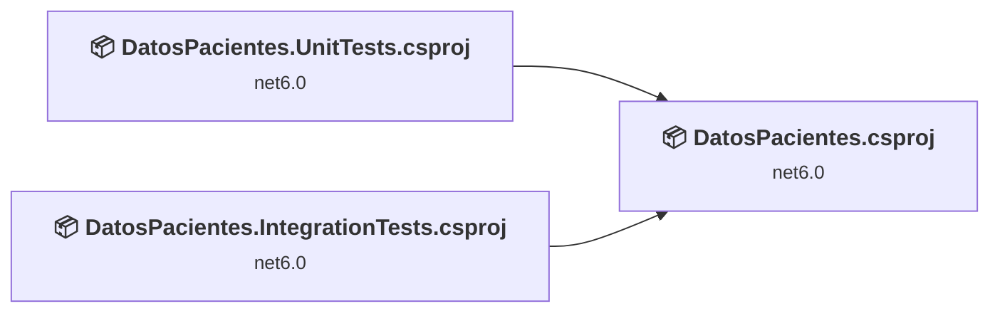
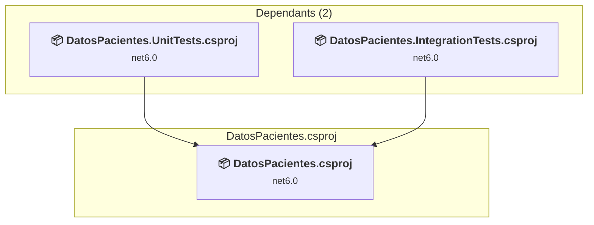
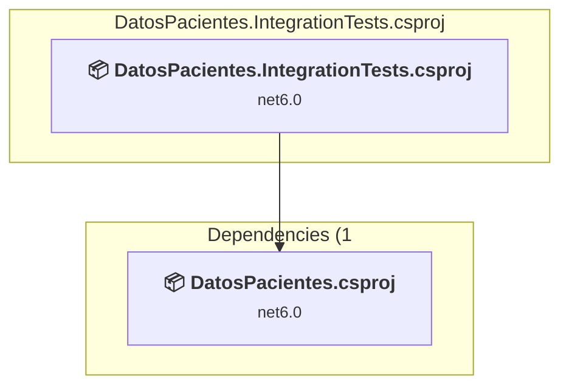
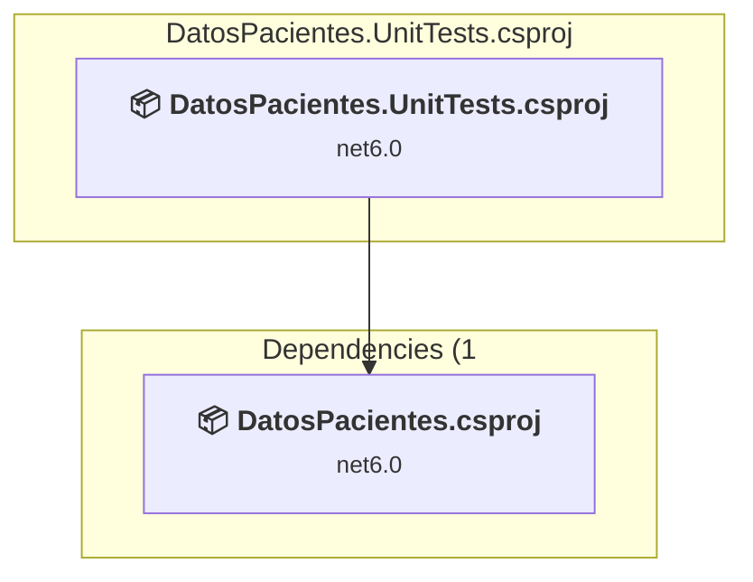

# Projects and dependencies analysis

This document provides a comprehensive overview of the projects and their dependencies in the context of upgrading to .NETCoreApp,Version=v10.0.

## Table of Contents

- [Executive Summary](#executive-Summary)
  - [Highlevel Metrics](#highlevel-metrics)
  - [Projects Compatibility](#projects-compatibility)
  - [Package Compatibility](#package-compatibility)
  - [API Compatibility](#api-compatibility)
- [Aggregate NuGet packages details](#aggregate-nuget-packages-details)
- [Top API Migration Challenges](#top-api-migration-challenges)
  - [Technologies and Features](#technologies-and-features)
  - [Most Frequent API Issues](#most-frequent-api-issues)
- [Projects Relationship Graph](#projects-relationship-graph)
- [Project Details](#project-details)

  - [src\DatosPacientes\DatosPacientes.csproj](#srcdatospacientesdatospacientescsproj)
  - [tests\DatosPacientes.IntegrationTests\DatosPacientes.IntegrationTests.csproj](#testsdatospacientesintegrationtestsdatospacientesintegrationtestscsproj)
  - [tests\DatosPacientes.UnitTests\DatosPacientes.UnitTests.csproj](#testsdatospacientesunittestsdatospacientesunittestscsproj)

## Executive Summary

### Highlevel Metrics

| Metric | Count | Status |
| :--- | :---: | :--- |
| Total Projects | 3 | All require upgrade |
| Total NuGet Packages | 14 | 7 need upgrade |
| Total Code Files | 39 |  |
| Total Code Files with Incidents | 4 |  |
| Total Lines of Code | 2885 |  |
| Total Number of Issues | 23 |  |
| Estimated LOC to modify | 13+ | at least 0.5% of codebase |

### Projects Compatibility

| Project | Target Framework | Difficulty | Package Issues | API Issues | Est. LOC Impact | Description |
| :--- | :---: | :---: | :---: | :---: | :---: | :--- |
| [src\DatosPacientes\DatosPacientes.csproj](#srcdatospacientesdatospacientescsproj) | net6.0 | 🟢 Low | 6 | 13 | 13+ | AspNetCore, Sdk Style = True |
| [tests\DatosPacientes.IntegrationTests\DatosPacientes.IntegrationTests.csproj](#testsdatospacientesintegrationtestsdatospacientesintegrationtestscsproj) | net6.0 | 🟢 Low | 1 | 0 |  | DotNetCoreApp, Sdk Style = True |
| [tests\DatosPacientes.UnitTests\DatosPacientes.UnitTests.csproj](#testsdatospacientesunittestsdatospacientesunittestscsproj) | net6.0 | 🟢 Low | 0 | 0 |  | DotNetCoreApp, Sdk Style = True |

### Package Compatibility

| Status | Count | Percentage |
| :--- | :---: | :---: |
| ✅ Compatible | 7 | 50.0% |
| ⚠️ Incompatible | 2 | 14.3% |
| 🔄 Upgrade Recommended | 5 | 35.7% |
| ***Total NuGet Packages*** | ***14*** | ***100%*** |

### API Compatibility

| Category | Count | Impact |
| :--- | :---: | :--- |
| 🔴 Binary Incompatible | 1 | High - Require code changes |
| 🟡 Source Incompatible | 6 | Medium - Needs re-compilation and potential conflicting API error fixing |
| 🔵 Behavioral change | 6 | Low - Behavioral changes that may require testing at runtime |
| ✅ Compatible | 4375 |  |
| ***Total APIs Analyzed*** | ***4388*** |  |

## Aggregate NuGet packages details

| Package | Current Version | Suggested Version | Projects | Description |
| :--- | :---: | :---: | :--- | :--- |
| AutoMapper.Extensions.Microsoft.DependencyInjection | 12.0.1 |  | [DatosPacientes.csproj](#srcdatospacientesdatospacientescsproj) | ⚠️El paquete NuGet está en desuso |
| Bogus.Healthcare | 34.0.2 |  | [DatosPacientes.IntegrationTests.csproj](#testsdatospacientesintegrationtestsdatospacientesintegrationtestscsproj) | ✅Compatible |
| coverlet.collector | 3.1.2 |  | [DatosPacientes.IntegrationTests.csproj](#testsdatospacientesintegrationtestsdatospacientesintegrationtestscsproj) [DatosPacientes.UnitTests.csproj](#testsdatospacientesunittestsdatospacientesunittestscsproj) | ✅Compatible |
| IdentityServer4.AccessTokenValidation | 3.0.1 |  | [DatosPacientes.csproj](#srcdatospacientesdatospacientescsproj) | ✅Compatible |
| Microsoft.EntityFrameworkCore.Design | 6.0.13 | 10.0.4 | [DatosPacientes.csproj](#srcdatospacientesdatospacientescsproj) | Se recomienda actualizar el paquete NuGet |
| Microsoft.EntityFrameworkCore.Sqlite | 6.0.16 | 10.0.4 | [DatosPacientes.IntegrationTests.csproj](#testsdatospacientesintegrationtestsdatospacientesintegrationtestscsproj) | Se recomienda actualizar el paquete NuGet |
| Microsoft.EntityFrameworkCore.SqlServer | 6.0.15 | 10.0.4 | [DatosPacientes.csproj](#srcdatospacientesdatospacientescsproj) | Se recomienda actualizar el paquete NuGet |
| Microsoft.EntityFrameworkCore.Tools | 6.0.13 | 10.0.4 | [DatosPacientes.csproj](#srcdatospacientesdatospacientescsproj) | Se recomienda actualizar el paquete NuGet |
| Microsoft.NET.Test.Sdk | 17.1.0 |  | [DatosPacientes.IntegrationTests.csproj](#testsdatospacientesintegrationtestsdatospacientesintegrationtestscsproj) [DatosPacientes.UnitTests.csproj](#testsdatospacientesunittestsdatospacientesunittestscsproj) | ✅Compatible |
| Microsoft.VisualStudio.Azure.Containers.Tools.Targets | 1.17.0 |  | [DatosPacientes.csproj](#srcdatospacientesdatospacientescsproj) | ⚠️El paquete NuGet no es compatible |
| Microsoft.VisualStudio.Web.CodeGeneration.Design | 6.0.11 | 10.0.2 | [DatosPacientes.csproj](#srcdatospacientesdatospacientescsproj) | Se recomienda actualizar el paquete NuGet |
| Swashbuckle.AspNetCore | 6.5.0 |  | [DatosPacientes.csproj](#srcdatospacientesdatospacientescsproj) | ✅Compatible |
| xunit | 2.4.1 |  | [DatosPacientes.IntegrationTests.csproj](#testsdatospacientesintegrationtestsdatospacientesintegrationtestscsproj) [DatosPacientes.UnitTests.csproj](#testsdatospacientesunittestsdatospacientesunittestscsproj) | ✅Compatible |
| xunit.runner.visualstudio | 2.4.3 |  | [DatosPacientes.IntegrationTests.csproj](#testsdatospacientesintegrationtestsdatospacientesintegrationtestscsproj) [DatosPacientes.UnitTests.csproj](#testsdatospacientesunittestsdatospacientesunittestscsproj) | ✅Compatible |

## Top API Migration Challenges

### Technologies and Features

| Technology | Issues | Percentage | Migration Path |
| :--- | :---: | :---: | :--- |

### Most Frequent API Issues

| API | Count | Percentage | Category |
| :--- | :---: | :---: | :--- |
| T:System.Uri | 4 | 30.8% | Behavioral Change |
| M:System.Uri.#ctor(System.String) | 2 | 15.4% | Behavioral Change |
| T:Microsoft.Extensions.DependencyInjection.ServiceCollectionExtensions | 1 | 7.7% | Binary Incompatible |
| P:Microsoft.AspNetCore.Authentication.JwtBearer.JwtBearerOptions.TokenValidationParameters | 1 | 7.7% | Source Incompatible |
| P:Microsoft.AspNetCore.Authentication.JwtBearer.JwtBearerOptions.Audience | 1 | 7.7% | Source Incompatible |
| P:Microsoft.AspNetCore.Authentication.JwtBearer.JwtBearerOptions.RequireHttpsMetadata | 1 | 7.7% | Source Incompatible |
| P:Microsoft.AspNetCore.Authentication.JwtBearer.JwtBearerOptions.Authority | 1 | 7.7% | Source Incompatible |
| T:Microsoft.Extensions.DependencyInjection.JwtBearerExtensions | 1 | 7.7% | Source Incompatible |
| M:Microsoft.Extensions.DependencyInjection.JwtBearerExtensions.AddJwtBearer(Microsoft.AspNetCore.Authentication.AuthenticationBuilder,System.String,System.Action{Microsoft.AspNetCore.Authentication.JwtBearer.JwtBearerOptions}) | 1 | 7.7% | Source Incompatible |

## Projects Relationship Graph

Legend:
📦 SDK-style project
⚙️ Classic project

## Project Details

### src\DatosPacientes\DatosPacientes.csproj

#### Project Info

- **Current Target Framework:** net6.0
- **Proposed Target Framework:** net10.0
- **SDK-style**: True
- **Project Kind:** AspNetCore
- **Dependencies**: 0
- **Dependants**: 2
- **Number of Files**: 36
- **Number of Files with Incidents**: 2
- **Lines of Code**: 2706
- **Estimated LOC to modify**: 13+ (at least 0.5% of the project)

#### Dependency Graph

Legend:
📦 SDK-style project
⚙️ Classic project

### API Compatibility

| Category | Count | Impact |
| :--- | :---: | :--- |
| 🔴 Binary Incompatible | 1 | High - Require code changes |
| 🟡 Source Incompatible | 6 | Medium - Needs re-compilation and potential conflicting API error fixing |
| 🔵 Behavioral change | 6 | Low - Behavioral changes that may require testing at runtime |
| ✅ Compatible | 4222 |  |
| ***Total APIs Analyzed*** | ***4235*** |  |

### tests\DatosPacientes.IntegrationTests\DatosPacientes.IntegrationTests.csproj

#### Project Info

- **Current Target Framework:** net6.0
- **Proposed Target Framework:** net10.0
- **SDK-style**: True
- **Project Kind:** DotNetCoreApp
- **Dependencies**: 1
- **Dependants**: 0
- **Number of Files**: 6
- **Number of Files with Incidents**: 1
- **Lines of Code**: 136
- **Estimated LOC to modify**: 0+ (at least 0.0% of the project)

#### Dependency Graph

Legend:
📦 SDK-style project
⚙️ Classic project

### API Compatibility

| Category | Count | Impact |
| :--- | :---: | :--- |
| 🔴 Binary Incompatible | 0 | High - Require code changes |
| 🟡 Source Incompatible | 0 | Medium - Needs re-compilation and potential conflicting API error fixing |
| 🔵 Behavioral change | 0 | Low - Behavioral changes that may require testing at runtime |
| ✅ Compatible | 117 |  |
| ***Total APIs Analyzed*** | ***117*** |  |

### tests\DatosPacientes.UnitTests\DatosPacientes.UnitTests.csproj

#### Project Info

- **Current Target Framework:** net6.0
- **Proposed Target Framework:** net10.0
- **SDK-style**: True
- **Project Kind:** DotNetCoreApp
- **Dependencies**: 1
- **Dependants**: 0
- **Number of Files**: 6
- **Number of Files with Incidents**: 1
- **Lines of Code**: 43
- **Estimated LOC to modify**: 0+ (at least 0.0% of the project)

#### Dependency Graph

Legend:
📦 SDK-style project
⚙️ Classic project

### API Compatibility

| Category | Count | Impact |
| :--- | :---: | :--- |
| 🔴 Binary Incompatible | 0 | High - Require code changes |
| 🟡 Source Incompatible | 0 | Medium - Needs re-compilation and potential conflicting API error fixing |
| 🔵 Behavioral change | 0 | Low - Behavioral changes that may require testing at runtime |
| ✅ Compatible | 36 |  |
| ***Total APIs Analyzed*** | ***36*** |  |

