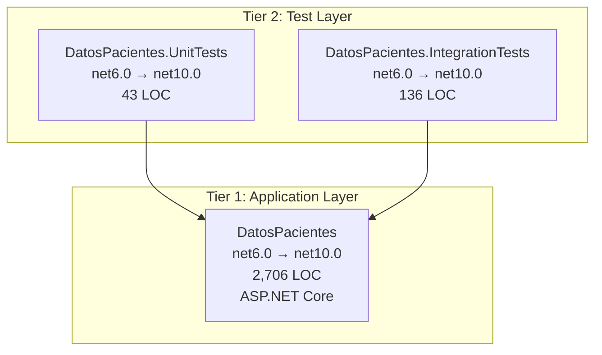

# .NET 6 to .NET 10 Migration Plan

## Table of Contents

- [Executive Summary](#executive-summary)
- [Migration Strategy](#migration-strategy)
- [Detailed Dependency Analysis](#detailed-dependency-analysis)
- [Implementation Timeline](#implementation-timeline)
- [Detailed Execution Steps](#detailed-execution-steps)
- [Project-by-Project Migration Plans](#project-by-project-migration-plans)
  - [DatosPacientes](#datospacientes)
  - [DatosPacientes.IntegrationTests](#datospacientesintegrationtests)
  - [DatosPacientes.UnitTests](#datospacientesunittests)
- [Package Update Reference](#package-update-reference)
- [Breaking Changes Catalog](#breaking-changes-catalog)
- [Risk Management](#risk-management)
- [Testing & Validation Strategy](#testing--validation-strategy)
- [Complexity & Effort Assessment](#complexity--effort-assessment)
- [Source Control Strategy](#source-control-strategy)
- [Success Criteria](#success-criteria)

---

## Executive Summary

### Scenario Overview

This plan details the upgrade of the **DatosPacientes** solution from **.NET 6.0** to **.NET 10.0 (Long Term Support)**. The solution consists of 3 projects:

- **DatosPacientes** (main ASP.NET Core application) - 2,706 LOC
- **DatosPacientes.IntegrationTests** (test project) - 136 LOC
- **DatosPacientes.UnitTests** (test project) - 43 LOC

**Total Codebase:** 2,885 lines of code across 39 files

### Scope & Complexity

**Complexity Classification: Simple Solution**

The solution exhibits characteristics ideal for a streamlined upgrade:

- **Small project count:** 3 projects (well below complexity threshold)
- **Shallow dependency tree:** Maximum depth of 2 levels (tests → main app)
- **All projects low difficulty:** No high-risk or complex projects identified
- **Manageable package ecosystem:** 14 packages, 7 requiring updates
- **SDK-style projects:** All projects already use modern SDK-style format
- **No security vulnerabilities:** No critical security issues requiring immediate attention
- **Limited code impact:** Only 4 files with compatibility incidents, estimated 13+ LOC to modify

### Discovered Metrics

| Metric | Value | Status |
|--------|-------|--------|
| Projects requiring upgrade | 3 | All projects |
| Package updates required | 7 | 2 incompatible, 5 recommended, 1 deprecated |
| API compatibility issues | 13 | 1 binary, 6 source, 6 behavioral |
| Files with incidents | 4 | 10.3% of codebase |
| Estimated LOC impact | 13+ | 0.5% of codebase |
| Dependency depth | 2 | Simple structure |
| All projects difficulty | Low | 🟢 Low risk |

### Critical Issues

**Package Compatibility:**
- ⚠️ **Microsoft.VisualStudio.Azure.Containers.Tools.Targets (1.17.0)**: Incompatible with .NET 10
- ⚠️ **AutoMapper.Extensions.Microsoft.DependencyInjection (12.0.1)**: Deprecated (still functional)
- 🔄 **5 Entity Framework packages**: Require major version updates (6.x → 10.x)

**API Compatibility:**
- 🔴 **1 Binary Incompatible API**: `ServiceCollectionExtensions` - requires code changes
- 🟡 **6 Source Incompatible APIs**: JWT Bearer authentication configuration properties
- 🔵 **6 Behavioral Changes**: `System.Uri` constructor behavior changes

### Selected Strategy

**All-At-Once Strategy** - All projects upgraded simultaneously in single atomic operation.

**Rationale:**
- Small solution (3 projects) ideal for coordinated upgrade
- All projects currently on .NET 6.0 (uniform starting point)
- Simple, linear dependency structure (no complex cross-dependencies)
- All packages have clear upgrade paths to .NET 10 compatible versions
- Low overall risk profile (all projects marked Low difficulty)
- Faster completion with single comprehensive testing phase
- No intermediate multi-targeting complexity required

### Expected Iterations

Based on simple solution classification, using **Fast Batch approach**:
- ✅ Phase 1: Discovery & Classification (Complete)
- ⏳ Phase 2: Foundation (3 iterations)
- ⏳ Phase 3: Detail Generation (2 iterations - all projects batched)
- **Total estimated:** 6 iterations

## Migration Strategy

### Approach Selection: All-At-Once

**Selected Strategy:** All projects upgraded simultaneously in a single atomic operation.

### Justification

**Why All-At-Once is Optimal for This Solution:**

1. **Small Solution Size**
   - Only 3 projects (well below 30-project threshold)
   - Total codebase under 3,000 LOC
   - All projects can be reasoned about and upgraded in single session

2. **Uniform Current State**
   - All projects currently on .NET 6.0
   - All projects using SDK-style format
   - Consistent technology stack (ASP.NET Core + xUnit)

3. **Simple Dependency Structure**
   - Linear, two-tier dependency graph
   - No complex cross-dependencies or cycles
   - Clear separation: application layer + test layer

4. **Clear Package Upgrade Paths**
   - All required package updates have known compatible versions
   - Entity Framework: 6.x → 10.x (established upgrade path)
   - Microsoft tooling: 6.x → 10.x (same major version alignment)
   - No deprecated packages blocking upgrade (AutoMapper deprecated but functional)

5. **Low Risk Profile**
   - All projects assessed as 🟢 Low difficulty
   - Limited code impact (13+ LOC, 0.5% of codebase)
   - No security vulnerabilities requiring careful staging
   - Test projects virtually no changes needed

6. **Efficiency Benefits**
   - Faster total completion time (single upgrade phase vs multiple)
   - No multi-targeting complexity
   - Single comprehensive testing cycle
   - All projects benefit from .NET 10 improvements simultaneously
   - Simpler coordination (no intermediate states to manage)

### All-At-Once Strategy Principles Applied

**Simultaneity:**
- All 3 project files updated to `<TargetFramework>net10.0</TargetFramework>` together
- All package references updated across all projects in single operation
- Single restore → build → fix → verify cycle

**Atomic Operation:**
- No intermediate state where some projects are .NET 6 and others .NET 10
- Either all projects upgraded successfully or none (rollback if critical failure)
- Single commit containing all upgrade changes

**Unified Testing:**
- Comprehensive test run after all projects upgraded
- Tests run against .NET 10 application (no .NET 6 test scenarios)
- Single validation checkpoint for entire solution

### Dependency-Based Ordering Within Atomic Operation

While all projects update simultaneously, the **fix and validation sequence** respects dependencies:

1. **Update Phase:** All project files + all packages (parallel, order-independent)
2. **Build Phase:** Solution-level build (MSBuild respects dependencies automatically)
3. **Fix Phase:** Address compilation errors (focus on DatosPacientes first since tests depend on it)
4. **Validation Phase:** Run tests (validates both application and test project upgrades)

### Risk Management for All-At-Once

**Mitigation Strategies:**

- **Pre-upgrade validation:** Verify .NET 10 SDK installed before starting
- **Comprehensive breaking changes catalog:** Document all 13 known API issues upfront
- **Clear rollback plan:** Single commit makes reverting straightforward if critical issues found
- **Test-first validation:** Both unit and integration tests must pass before considering upgrade complete
- **Package compatibility verification:** All package updates tested together (no sequential package update risk)

**Why This Doesn't Introduce Excessive Risk:**

- Main complexity concentrated in 1 project (DatosPacientes)
- Test projects provide immediate validation feedback
- Known API issues (13 total) are manageable scope
- Package updates are well-documented framework migrations (EF 6→10)
- No mission-critical production deployment required immediately

### Alternative Approach Considered (and Rejected)

**Incremental Migration (Not Selected):**

Could upgrade DatosPacientes first, then test projects separately.

**Why Rejected:**
- Adds unnecessary complexity for 3-project solution
- Would require multi-targeting or temporarily broken test projects
- Longer total timeline with no meaningful risk reduction
- Test projects have virtually no upgrade complexity (no code changes expected)
- Package version alignment simpler when upgraded together (EF versions consistent)

### Execution Approach

**Single Coordinated Operation:**

```
[Phase 0: Prerequisites] 
  ↓
[Phase 1: Atomic Upgrade]
  • Update all project files (3 projects)
  • Update all packages (7 packages across projects)
  • Restore dependencies
  • Build solution
  • Fix all compilation errors (13 API issues)
  • Rebuild and verify
  ↓
[Phase 2: Test Validation]
  • Run unit tests (DatosPacientes.UnitTests)
  • Run integration tests (DatosPacientes.IntegrationTests)
  • Address any test failures
  ↓
[Complete: All projects on .NET 10, all tests passing]
```

**Source Control Strategy:** Prefer single commit containing all changes (see [Source Control Strategy](#source-control-strategy) section for details).

### Success Indicators

Migration complete when:
- ✅ All 3 projects targeting net10.0
- ✅ All 7 package updates applied
- ✅ Solution builds with 0 errors, 0 warnings
- ✅ All unit tests pass
- ✅ All integration tests pass
- ✅ No package dependency conflicts
- ✅ Application runs successfully (manual smoke test)

## Detailed Dependency Analysis

### Dependency Graph Structure

The solution has a simple, two-tier dependency structure with clear separation between application and test layers:

```
DatosPacientes (Main Application)
├── DatosPacientes.UnitTests (depends on main)
└── DatosPacientes.IntegrationTests (depends on main)
```

**Mermaid Visualization:**



### Project Groupings for Migration

**All-At-Once Approach: Single Atomic Operation**

All 3 projects will be upgraded simultaneously in one coordinated operation. The grouping below shows logical tiers for understanding dependencies, but migration happens atomically:

**Tier 1: Application Foundation (1 project)**
- `src\DatosPacientes\DatosPacientes.csproj`
  - ASP.NET Core application
  - 2,706 LOC
  - 6 package updates required
  - 13 API compatibility issues
  - **Role:** Core application - must be upgraded successfully for tests to function

**Tier 2: Test Projects (2 projects)**
- `tests\DatosPacientes.UnitTests\DatosPacientes.UnitTests.csproj`
  - 43 LOC
  - No package updates required
  - No API issues
  - **Role:** Unit tests validation

- `tests\DatosPacientes.IntegrationTests\DatosPacientes.IntegrationTests.csproj`
  - 136 LOC
  - 1 package update required
  - No API issues
  - **Role:** Integration tests validation

### Critical Path Identification

**Critical Path:** DatosPacientes → Test Projects

Since all projects upgrade atomically, the critical path is the validation sequence:

1. **Update all project files** (all 3 projects simultaneously)
2. **Update all packages** (across all projects simultaneously)
3. **Restore and build** (entire solution)
4. **Fix compilation errors** (primarily in DatosPacientes where API issues exist)
5. **Run tests** (both test projects against upgraded main project)

**Key Insight:** The main application (DatosPacientes) contains all the complexity:
- All 13 API issues are in this project
- 6 of 7 package updates are in this project
- All breaking changes manifest here

Test projects are straightforward upgrades with minimal/no code changes expected.

### Dependency Characteristics

**No Circular Dependencies:** Clean unidirectional dependency flow

**No External Project Dependencies:** All projects are within the solution

**Package Dependency Alignment:**
- Entity Framework packages must align versions across projects (main uses EF Core 6.x, integration tests use EF Core Sqlite 6.x)
- Test framework packages (xUnit, Microsoft.NET.Test.Sdk) are isolated to test projects
- No conflicting package version requirements detected

**Migration Order Flexibility:**
Since using All-At-Once strategy, there's no sequential migration order. All projects update simultaneously, ensuring version alignment from the start.

## Implementation Timeline

### Phase 0: Prerequisites (if applicable)

**Objective:** Ensure development environment ready for .NET 10

**Operations:**
- Verify .NET 10 SDK installed
- Check no global.json conflicts

**Deliverables:** Environment validated for .NET 10 development

**Expected Duration:** Minimal (validation checks)

---

### Phase 1: Atomic Upgrade

**Objective:** Upgrade all projects, packages, and fix compilation errors in single coordinated operation

**Operations** (performed as single batch):

1. **Update all project target frameworks** (3 projects)
   - DatosPacientes: net6.0 → net10.0
   - DatosPacientes.IntegrationTests: net6.0 → net10.0
   - DatosPacientes.UnitTests: net6.0 → net10.0

2. **Update all package references** (7 package updates)
   - See [Package Update Reference](#package-update-reference) for complete matrix

3. **Restore dependencies**
   - `dotnet restore` for entire solution

4. **Build solution and fix all compilation errors**
   - Address all 13 API compatibility issues
   - See [Breaking Changes Catalog](#breaking-changes-catalog) for comprehensive list
   - Focus areas: JWT authentication, dependency injection, System.Uri usage

5. **Rebuild and verify**
   - Solution builds with 0 errors

**Deliverables:** 
- All projects on net10.0
- All packages updated
- Solution builds successfully
- Zero compilation errors

**Complexity:** Medium (13 API issues to resolve)

---

### Phase 2: Test Validation

**Objective:** Verify application functionality through automated tests

**Operations:**

1. **Execute unit tests**
   - Run DatosPacientes.UnitTests
   - Verify all tests pass

2. **Execute integration tests**
   - Run DatosPacientes.IntegrationTests
   - Verify all tests pass

3. **Address test failures** (if any)
   - Investigate root causes
   - Apply fixes
   - Re-run tests

**Deliverables:**
- All unit tests passing
- All integration tests passing
- No regression in functionality

**Complexity:** Low (test projects have no API issues)

---

### Phase 3: Final Validation (Manual)

**Objective:** Confirm application runtime behavior

**Operations:**

1. **Smoke test application**
   - Start DatosPacientes application
   - Verify key endpoints respond
   - Check Swagger UI loads correctly
   - Confirm authentication flow works

2. **Review warnings**
   - Check for any build warnings introduced
   - Address any non-critical warnings if appropriate

**Deliverables:**
- Application runs successfully
- No critical warnings
- Ready for source control commit

**Complexity:** Low (validation only)

---

### Timeline Summary

| Phase | Focus | Complexity | Dependencies |
|-------|-------|------------|--------------|
| Phase 0 | Prerequisites | Low | None |
| Phase 1 | Atomic Upgrade | Medium | Phase 0 |
| Phase 2 | Test Validation | Low | Phase 1 |
| Phase 3 | Final Validation | Low | Phase 2 |

**Total Phases:** 4 (3 execution + 1 manual validation)

**Critical Path:** Phase 1 (contains all complexity) → Phase 2 (validation)

## Detailed Execution Steps

### Overview

This section provides the step-by-step execution sequence for the atomic upgrade. All steps are performed in a single coordinated operation.

---

### Step 0: Prerequisites Validation

**Verify .NET 10 SDK Installation:**

```bash
dotnet --list-sdks
```

Expected output should include: `10.0.xxx`

If not installed, download from: https://dotnet.microsoft.com/download/dotnet/10.0

**Check for global.json Conflicts:**

If `global.json` exists at solution or repository root, verify SDK version:

```bash
# Check if global.json exists
Get-ChildItem -Path C:\Users\aajucum\source\repos\Pacientes -Filter global.json -Recurse
```

If found, review content and ensure it doesn't pin SDK to version < 10.0.

**Validation Checklist:**
- [ ] .NET 10 SDK installed
- [ ] No global.json blocking .NET 10 usage (or global.json updated)
- [ ] Current branch is `upgrade-to-NET10`
- [ ] No pending uncommitted changes (clean working directory)

---

### Step 1: Update Project Target Frameworks

**Update all 3 project files to target net10.0:**

**File:** `src\DatosPacientes\DatosPacientes.csproj`

Change:
```xml
<TargetFramework>net6.0</TargetFramework>
```

To:
```xml
<TargetFramework>net10.0</TargetFramework>
```

**File:** `tests\DatosPacientes.IntegrationTests\DatosPacientes.IntegrationTests.csproj`

Change:
```xml
<TargetFramework>net6.0</TargetFramework>
```

To:
```xml
<TargetFramework>net10.0</TargetFramework>
```

**File:** `tests\DatosPacientes.UnitTests\DatosPacientes.UnitTests.csproj`

Change:
```xml
<TargetFramework>net6.0</TargetFramework>
```

To:
```xml
<TargetFramework>net10.0</TargetFramework>
```

**Verification:** All project files contain `<TargetFramework>net10.0</TargetFramework>`

---

### Step 2: Update Package References

**Update all package references across all projects to .NET 10 compatible versions.**

See [Package Update Reference](#package-update-reference) for complete version matrix.

**Key Package Updates:**

**In `src\DatosPacientes\DatosPacientes.csproj`:**

1. **Microsoft.EntityFrameworkCore.Design:** 6.0.13 → 10.0.4
   ```xml
   <PackageReference Include="Microsoft.EntityFrameworkCore.Design" Version="10.0.4">
   ```

2. **Microsoft.EntityFrameworkCore.SqlServer:** 6.0.15 → 10.0.4
   ```xml
   <PackageReference Include="Microsoft.EntityFrameworkCore.SqlServer" Version="10.0.4" />
   ```

3. **Microsoft.EntityFrameworkCore.Tools:** 6.0.13 → 10.0.4
   ```xml
   <PackageReference Include="Microsoft.EntityFrameworkCore.Tools" Version="10.0.4">
   ```

4. **Microsoft.VisualStudio.Web.CodeGeneration.Design:** 6.0.11 → 10.0.2
   ```xml
   <PackageReference Include="Microsoft.VisualStudio.Web.CodeGeneration.Design" Version="10.0.2" />
   ```

5. **Microsoft.VisualStudio.Azure.Containers.Tools.Targets:** 1.17.0 → **ASSESS**
   - This package is marked incompatible
   - **Action:** Try removing it first (often development-only tooling)
   - If needed, search for .NET 10 compatible alternative
   - Not blocking if removed

6. **AutoMapper.Extensions.Microsoft.DependencyInjection:** 12.0.1 → **NO CHANGE**
   - Deprecated but still functional
   - Continue using 12.0.1 for this upgrade
   - Consider migration to alternative in future

**In `tests\DatosPacientes.IntegrationTests\DatosPacientes.IntegrationTests.csproj`:**

1. **Microsoft.EntityFrameworkCore.Sqlite:** 6.0.16 → 10.0.4
   ```xml
   <PackageReference Include="Microsoft.EntityFrameworkCore.Sqlite" Version="10.0.4" />
   ```

**In `tests\DatosPacientes.UnitTests\DatosPacientes.UnitTests.csproj`:**

- No package updates required (all packages already compatible)

**Package Updates Summary:**
- ✅ 5 packages updated to version 10.x
- ⚠️ 1 package to assess/remove (Azure Container Tools)
- ✅ 1 package unchanged (AutoMapper - deprecated but works)
- ✅ 7 packages already compatible (no action needed)

---

### Step 3: Restore Dependencies

**Restore NuGet packages for entire solution:**

```bash
cd C:\Users\aajucum\source\repos\Pacientes
dotnet restore DatosPacientes.sln
```

**Expected Output:**
```
Restore completed in X ms for C:\Users\aajucum\source\repos\Pacientes\src\DatosPacientes\DatosPacientes.csproj.
Restore completed in Y ms for C:\Users\aajucum\source\repos\Pacientes\tests\DatosPacientes.IntegrationTests\DatosPacientes.IntegrationTests.csproj.
Restore completed in Z ms for C:\Users\aajucum\source\repos\Pacientes\tests\DatosPacientes.UnitTests\DatosPacientes.UnitTests.csproj.
```

**Troubleshooting:**
- If restore fails with package conflicts, review [Package Update Reference](#package-update-reference)
- If Azure Container Tools causes issues, remove the package reference and retry

---

### Step 4: Build Solution to Identify Compilation Errors

**Build entire solution:**

```bash
dotnet build DatosPacientes.sln
```

**Expected Result:** Compilation errors due to API compatibility issues.

**Known Compilation Errors to Expect:**

Based on assessment, expect errors related to:

1. **ServiceCollectionExtensions (Binary Incompatible)**
   - Error locating service registration code
   - Related to dependency injection setup

2. **JWT Bearer Authentication (6 Source Incompatible APIs)**
   - Errors in authentication configuration code
   - Properties like `TokenValidationParameters`, `Audience`, `Authority`, `RequireHttpsMetadata`
   - Likely in `Startup.cs` or `Program.cs` authentication setup

3. **Potential Warnings** for System.Uri behavioral changes (not blocking compilation)

**Document All Errors:**
- Capture full error messages
- Note file paths and line numbers
- Group by root cause (JWT auth, DI, etc.)

---

### Step 5: Fix All Compilation Errors

**Address each category of errors systematically.**

See [Breaking Changes Catalog](#breaking-changes-catalog) for comprehensive API change details and resolution strategies.

**Focus Areas:**

**5.1: Dependency Injection Service Registration**

**Error Pattern:** `ServiceCollectionExtensions` method not found or signature mismatch

**Resolution Strategy:**
- Review dependency injection setup in `Startup.cs` or `Program.cs`
- Check for changed method signatures in service registration
- Consult .NET 10 dependency injection documentation
- Update service registration pattern to .NET 10 conventions

**Likely Files:**
- `src\DatosPacientes\Startup.cs` (if using Startup pattern)
- `src\DatosPacientes\Program.cs` (if using minimal hosting)

**5.2: JWT Bearer Authentication Configuration**

**Error Pattern:** Properties on `JwtBearerOptions` not found or type mismatches

**Affected APIs:**
- `JwtBearerOptions.TokenValidationParameters`
- `JwtBearerOptions.Audience`
- `JwtBearerOptions.Authority`
- `JwtBearerOptions.RequireHttpsMetadata`
- `JwtBearerExtensions.AddJwtBearer` method

**Resolution Strategy:**
- Locate JWT Bearer authentication setup (likely in authentication configuration)
- Review .NET 10 authentication middleware documentation
- Check for property renames, namespace changes, or new required parameters
- Update authentication configuration to match .NET 10 API

**Likely Files:**
- `src\DatosPacientes\Startup.cs` or `Program.cs` (authentication setup)
- Any custom authentication configuration classes

**Example Pattern (hypothetical - actual changes may vary):**

Old (.NET 6):
```csharp
services.AddAuthentication()
    .AddJwtBearer("Bearer", options =>
    {
        options.Authority = "https://identity.server";
        options.Audience = "api1";
        options.RequireHttpsMetadata = false;
        options.TokenValidationParameters = new TokenValidationParameters
        {
            ValidateAudience = true
        };
    });
```

May need update to (.NET 10 - check documentation):
```csharp
// Check for namespace changes, property renames, or new configuration patterns
// Consult: https://learn.microsoft.com/en-us/aspnet/core/migration/
```

**5.3: System.Uri Behavioral Changes**

**Nature:** Behavioral changes (not compilation errors)

**Action:** Review but likely no code changes needed immediately

**Validation:** Covered in testing phase (Step 7)

**5.4: Azure Container Tools (if removal attempted)**

If `Microsoft.VisualStudio.Azure.Containers.Tools.Targets` was removed and build succeeds, no further action.

If removal causes issues:
- Assess actual usage of container tooling features
- Search for .NET 10 compatible alternative package
- Document decision (keep, remove, replace)

**5.5: AutoMapper (Deprecated Package)**

**Expected:** No compilation errors (package works in .NET 10)

**Action if errors occur:**
- Verify AutoMapper configuration in DI setup
- Check for any AutoMapper API changes (unlikely but possible)
- Consider migrating to maintained alternative if issues arise

**Iteration:**
- Fix errors incrementally
- Rebuild after each fix to validate progress
- Group related errors and fix together

---

### Step 6: Rebuild Solution and Verify Zero Errors

**Rebuild entire solution:**

```bash
dotnet clean DatosPacientes.sln
dotnet build DatosPacientes.sln --configuration Release
```

**Success Criteria:**
- ✅ Build succeeded
- ✅ 0 errors
- ✅ 0 warnings (or only acceptable warnings documented)
- ✅ All 3 projects build successfully

**If Build Still Fails:**
- Review remaining error messages
- Consult [Breaking Changes Catalog](#breaking-changes-catalog)
- Check .NET 10 migration documentation: https://learn.microsoft.com/en-us/dotnet/core/compatibility/
- Review Entity Framework Core 10 breaking changes if EF-related errors

---

### Step 7: Execute All Tests

**7.1: Run Unit Tests**

```bash
dotnet test tests\DatosPacientes.UnitTests\DatosPacientes.UnitTests.csproj --configuration Release
```

**Expected Result:** All tests pass (no code changes expected in unit test project)

**If Tests Fail:**
- Review test failure messages
- Determine if failure is due to:
  - Application code changes needed (fix in DatosPacientes project)
  - Test expectations need updating (update test assertions)
  - Genuine regression (investigate and fix)

**7.2: Run Integration Tests**

```bash
dotnet test tests\DatosPacientes.IntegrationTests\DatosPacientes.IntegrationTests.csproj --configuration Release
```

**Expected Result:** All tests pass

**Special Attention:**
- Database interactions (EF Core 10 may have query generation changes)
- Authentication flows (JWT configuration changes validated here)
- API endpoint tests (behavioral changes in routing, model binding)

**If Tests Fail:**
- Check for EF Core query translation changes
- Validate database schema compatibility
- Review authentication test scenarios
- Investigate System.Uri behavioral changes if URL-related tests fail

**7.3: Full Solution Test Run**

```bash
dotnet test DatosPacientes.sln --configuration Release
```

**Success Criteria:**
- ✅ All unit tests pass
- ✅ All integration tests pass
- ✅ 0 test failures
- ✅ No test skips (unless expected)

---

### Step 8: Manual Smoke Testing

**8.1: Start Application**

```bash
cd src\DatosPacientes
dotnet run
```

**Observe:**
- Application starts without errors
- No startup exceptions logged
- Port binding succeeds

**8.2: Verify Swagger UI**

Navigate to: `https://localhost:<port>/swagger`

**Validate:**
- Swagger UI loads correctly
- All endpoints listed
- API documentation renders

**8.3: Test Key Endpoints**

Using Swagger UI or Postman/curl:

1. **Health check endpoint** (if exists)
2. **Authentication endpoint** (verify JWT token generation/validation)
3. **Sample GET endpoint** (verify data retrieval)
4. **Sample POST endpoint** (verify data creation)

**8.4: Check Logs**

Review application logs for:
- ⚠️ Warnings or errors at startup
- ⚠️ Deprecation warnings
- ⚠️ Unexpected behavior messages

**8.5: Database Connectivity**

If application uses database:
- Verify database connection succeeds
- Test a simple query operation
- Confirm Entity Framework context initialization

**Success Criteria:**
- ✅ Application runs without exceptions
- ✅ Swagger UI accessible and functional
- ✅ Key endpoints respond correctly
- ✅ Authentication flow works (if applicable)
- ✅ Database operations succeed (if applicable)
- ✅ No critical warnings in logs

---

### Step 9: Review and Address Warnings

**Check Build Warnings:**

```bash
dotnet build DatosPacientes.sln --configuration Release /warnaserror
```

**Review Any Warnings:**
- Obsolete API usage warnings
- Nullable reference type warnings
- Potential null reference warnings
- Deprecated API warnings

**Triage Warnings:**
- **Critical:** Warnings indicating future breaking changes → Address now
- **Important:** Warnings about best practices → Address if feasible
- **Informational:** Non-blocking warnings → Document and address later

**Common .NET 10 Warnings to Expect:**
- Nullable reference type warnings (if not fully adopted)
- Obsolete API warnings (plan for future updates)
- Trim analysis warnings (if AOT/trimming enabled)

---

### Validation Checkpoint

**Before Proceeding to Commit:**

- [ ] All 3 projects target net10.0
- [ ] All required package updates applied (5 packages to 10.x versions)
- [ ] Azure Container Tools assessed (removed or resolved)
- [ ] Solution builds with 0 errors
- [ ] Solution builds with 0 warnings (or acceptable warnings documented)
- [ ] All unit tests pass
- [ ] All integration tests pass
- [ ] Application starts and runs successfully
- [ ] Swagger UI loads and functions
- [ ] Key endpoints validated manually
- [ ] Authentication flow verified (if applicable)
- [ ] No critical errors in application logs
- [ ] Database operations validated (if applicable)

**If All Checkboxes Checked:** Proceed to source control commit (see [Source Control Strategy](#source-control-strategy))

**If Any Checkbox Unchecked:** Investigate and resolve before committing

## Project-by-Project Migration Plans

### DatosPacientes

**Project Path:** `src\DatosPacientes\DatosPacientes.csproj`

#### Current State

- **Current Target Framework:** net6.0
- **Project Type:** ASP.NET Core Web Application
- **SDK-Style:** Yes
- **Lines of Code:** 2,706
- **Number of Files:** 36
- **Files with Incidents:** 2
- **Dependencies (Project References):** None
- **Dependants:** 2 (both test projects)
- **Role:** Core application providing REST API with Entity Framework data access, JWT authentication, Swagger documentation

**Package Dependencies (Current):**
- AutoMapper.Extensions.Microsoft.DependencyInjection 12.0.1
- IdentityServer4.AccessTokenValidation 3.0.1
- Microsoft.EntityFrameworkCore.Design 6.0.13
- Microsoft.EntityFrameworkCore.SqlServer 6.0.15
- Microsoft.EntityFrameworkCore.Tools 6.0.13
- Microsoft.VisualStudio.Azure.Containers.Tools.Targets 1.17.0
- Microsoft.VisualStudio.Web.CodeGeneration.Design 6.0.11
- Swashbuckle.AspNetCore 6.5.0

**API Compatibility Issues:**
- 🔴 1 Binary Incompatible: ServiceCollectionExtensions
- 🟡 6 Source Incompatible: JWT Bearer authentication configuration APIs
- 🔵 6 Behavioral Changes: System.Uri usage

#### Target State

- **Target Framework:** net10.0
- **Expected Package Count:** 8 (same, with version updates)
- **Expected Code Changes:** ~13 lines (0.5% of project)

#### Migration Steps

**1. Prerequisites**
- Ensure .NET 10 SDK installed
- Verify no global.json conflicts

**2. Update Target Framework**

Edit `src\DatosPacientes\DatosPacientes.csproj`:

```xml
<TargetFramework>net10.0</TargetFramework>
```

**3. Update Package References**

| Package | Current | Target | Reason |
|---------|---------|--------|--------|
| Microsoft.EntityFrameworkCore.Design | 6.0.13 | 10.0.4 | Framework alignment |
| Microsoft.EntityFrameworkCore.SqlServer | 6.0.15 | 10.0.4 | Framework alignment |
| Microsoft.EntityFrameworkCore.Tools | 6.0.13 | 10.0.4 | Framework alignment |
| Microsoft.VisualStudio.Web.CodeGeneration.Design | 6.0.11 | 10.0.2 | Framework alignment |
| Microsoft.VisualStudio.Azure.Containers.Tools.Targets | 1.17.0 | **REMOVE** or find alternative | Incompatible |
| AutoMapper.Extensions.Microsoft.DependencyInjection | 12.0.1 | **NO CHANGE** | Deprecated but functional |
| IdentityServer4.AccessTokenValidation | 3.0.1 | **NO CHANGE** | Already compatible |
| Swashbuckle.AspNetCore | 6.5.0 | **NO CHANGE** | Already compatible |

**4. Expected Breaking Changes**

**4.1: Dependency Injection (Binary Incompatible)**

**API:** `Microsoft.Extensions.DependencyInjection.ServiceCollectionExtensions`

**Impact:** High - will not compile

**Location:** Likely in `Startup.cs` or `Program.cs`

**Resolution:**
- Review service registration code
- Check for method signature changes in AddXxx extension methods
- Update to .NET 10 dependency injection patterns
- Consult: https://learn.microsoft.com/en-us/dotnet/core/compatibility/aspnet-core/10.0/

**4.2: JWT Bearer Authentication (Source Incompatible - 6 APIs)**

**APIs:**
- `Microsoft.AspNetCore.Authentication.JwtBearer.JwtBearerOptions.TokenValidationParameters`
- `Microsoft.AspNetCore.Authentication.JwtBearer.JwtBearerOptions.Audience`
- `Microsoft.AspNetCore.Authentication.JwtBearer.JwtBearerOptions.Authority`
- `Microsoft.AspNetCore.Authentication.JwtBearer.JwtBearerOptions.RequireHttpsMetadata`
- `Microsoft.Extensions.DependencyInjection.JwtBearerExtensions`
- `Microsoft.Extensions.DependencyInjection.JwtBearerExtensions.AddJwtBearer`

**Impact:** High - will not compile

**Location:** Authentication configuration (likely `Startup.cs` or `Program.cs`)

**Resolution Strategy:**
1. Locate JWT Bearer authentication setup code
2. Check for property renames or namespace changes
3. Review .NET 10 authentication documentation
4. Update `AddJwtBearer` configuration
5. Verify `TokenValidationParameters` setup
6. Test authentication flow thoroughly

**Potential Change Pattern:**
- Properties may have moved to different configuration objects
- Some properties may require different types
- Authentication middleware registration may have new overloads

**Validation:**
- Compile successfully
- Authentication integration tests must pass
- Manual test of token generation/validation

**4.3: System.Uri Behavioral Changes (6 instances)**

**API:** `System.Uri` constructor and related methods

**Impact:** Low - behavioral change, not compilation error

**Location:** URL construction/parsing code (specific files identified in assessment)

**Expected Behavior Change:**
- URI parsing rules may differ slightly
- Validation of URI formats may be stricter
- Relative URI handling may change

**Resolution:**
- Review URI construction code in affected files
- Validate URL generation in tests
- Check for any runtime exceptions related to URI parsing
- Update URI construction if needed

**Validation:**
- Integration tests for URL-related functionality
- Manual testing of endpoints with various URL patterns

**5. Code Modifications Required**

**Primary Files to Modify:**
- `Startup.cs` or `Program.cs` (authentication, DI setup)
- Any files using `System.Uri` (6 instances across 2 files per assessment)

**Expected Changes:**
- Update JWT Bearer configuration properties
- Adjust service registration patterns
- Possibly update URI construction patterns

**6. Testing Strategy**

**Unit Tests:**
- Run `DatosPacientes.UnitTests` after fixes
- All tests should pass (test project has no changes)

**Integration Tests:**
- Run `DatosPacientes.IntegrationTests` after fixes
- Focus on:
  - Authentication flows (JWT validation)
  - Database operations (EF Core 10 compatibility)
  - API endpoint responses
  - URL generation/routing

**Manual Testing:**
- Start application
- Test Swagger UI
- Validate JWT token generation/validation
- Test sample CRUD operations
- Check database connectivity

**7. Validation Checklist**

- [ ] Project targets net10.0
- [ ] All packages updated (6 updates applied, 1 removed/resolved, 1 unchanged deprecated)
- [ ] Solution builds without errors
- [ ] No critical warnings
- [ ] Service registration compiles (ServiceCollectionExtensions issue resolved)
- [ ] Authentication configuration compiles (JWT Bearer issues resolved)
- [ ] Unit tests pass
- [ ] Integration tests pass
- [ ] Application starts successfully
- [ ] Swagger UI loads
- [ ] Authentication flow validated
- [ ] Database operations work
- [ ] No runtime exceptions related to System.Uri

**Estimated Complexity:** Medium (primary source of all solution complexity)

---

### DatosPacientes.IntegrationTests

**Project Path:** `tests\DatosPacientes.IntegrationTests\DatosPacientes.IntegrationTests.csproj`

#### Current State

- **Current Target Framework:** net6.0
- **Project Type:** Test Project (xUnit)
- **SDK-Style:** Yes
- **Lines of Code:** 136
- **Number of Files:** 6
- **Files with Incidents:** 1
- **Dependencies (Project References):** 1 (DatosPacientes)
- **Dependants:** None
- **Role:** Integration tests for DatosPacientes API

**Package Dependencies (Current):**
- Bogus.Healthcare 34.0.2
- coverlet.collector 3.1.2
- Microsoft.EntityFrameworkCore.Sqlite 6.0.16
- Microsoft.NET.Test.Sdk 17.1.0
- xunit 2.4.1
- xunit.runner.visualstudio 2.4.3

**API Compatibility Issues:** None

#### Target State

- **Target Framework:** net10.0
- **Expected Package Count:** 6 (same, with 1 version update)
- **Expected Code Changes:** 0 (no API issues)

#### Migration Steps

**1. Update Target Framework**

Edit `tests\DatosPacientes.IntegrationTests\DatosPacientes.IntegrationTests.csproj`:

```xml
<TargetFramework>net10.0</TargetFramework>
```

**2. Update Package References**

| Package | Current | Target | Reason |
|---------|---------|--------|--------|
| Microsoft.EntityFrameworkCore.Sqlite | 6.0.16 | 10.0.4 | Align with main project EF version |
| Bogus.Healthcare | 34.0.2 | **NO CHANGE** | Already compatible |
| coverlet.collector | 3.1.2 | **NO CHANGE** | Already compatible |
| Microsoft.NET.Test.Sdk | 17.1.0 | **NO CHANGE** | Already compatible |
| xunit | 2.4.1 | **NO CHANGE** | Already compatible |
| xunit.runner.visualstudio | 2.4.3 | **NO CHANGE** | Already compatible |

**3. Expected Breaking Changes**

**None expected.** This test project has no API compatibility issues identified.

**Possible Impact from Main Project Changes:**
- If DatosPacientes authentication or API changes, test setup may need updates
- If database schema changes, test data setup may need adjustments
- EF Core 10 Sqlite provider may have minor behavioral differences

**4. Code Modifications Required**

**Expected:** No code changes needed

**Possible Adjustments:**
- Test setup code if main project authentication changes
- Database initialization code if EF migrations changed
- Test assertions if API response formats changed (unlikely)

**5. Testing Strategy**

**Run Integration Tests:**
```bash
dotnet test tests\DatosPacientes.IntegrationTests\DatosPacientes.IntegrationTests.csproj
```

**Focus Areas:**
- Database tests (EF Core Sqlite 10 compatibility)
- API endpoint tests (validate against upgraded DatosPacientes)
- Authentication tests (JWT flow changes validated)

**If Tests Fail:**
- Check if failure is due to main project changes
- Review EF Core Sqlite query generation changes
- Validate test database setup with EF 10

**6. Validation Checklist**

- [ ] Project targets net10.0
- [ ] Microsoft.EntityFrameworkCore.Sqlite updated to 10.0.4
- [ ] Project builds without errors
- [ ] No warnings
- [ ] All integration tests pass
- [ ] Test execution time comparable to .NET 6 (no performance regression)

**Estimated Complexity:** Low (minimal changes expected)

---

### DatosPacientes.UnitTests

**Project Path:** `tests\DatosPacientes.UnitTests\DatosPacientes.UnitTests.csproj`

#### Current State

- **Current Target Framework:** net6.0
- **Project Type:** Test Project (xUnit)
- **SDK-Style:** Yes
- **Lines of Code:** 43
- **Number of Files:** 6
- **Files with Incidents:** 1
- **Dependencies (Project References):** 1 (DatosPacientes)
- **Dependants:** None
- **Role:** Unit tests for DatosPacientes core logic

**Package Dependencies (Current):**
- coverlet.collector 3.1.2
- Microsoft.NET.Test.Sdk 17.1.0
- xunit 2.4.1
- xunit.runner.visualstudio 2.4.3

**API Compatibility Issues:** None

#### Target State

- **Target Framework:** net10.0
- **Expected Package Count:** 4 (same, no version updates needed)
- **Expected Code Changes:** 0 (no API issues, no package updates)

#### Migration Steps

**1. Update Target Framework**

Edit `tests\DatosPacientes.UnitTests\DatosPacientes.UnitTests.csproj`:

```xml
<TargetFramework>net10.0</TargetFramework>
```

**2. Update Package References**

**No package updates required.** All packages already compatible with .NET 10:
- coverlet.collector 3.1.2 ✅
- Microsoft.NET.Test.Sdk 17.1.0 ✅
- xunit 2.4.1 ✅
- xunit.runner.visualstudio 2.4.3 ✅

**3. Expected Breaking Changes**

**None.** This project has:
- No API compatibility issues
- No package updates required
- Minimal code (43 LOC)

**4. Code Modifications Required**

**Expected:** No code changes needed

**Possible Adjustments (if main project changes affect tests):**
- Test setup if DI patterns changed
- Test mocking if interfaces changed
- Assertions if behavior changed

**5. Testing Strategy**

**Run Unit Tests:**
```bash
dotnet test tests\DatosPacientes.UnitTests\DatosPacientes.UnitTests.csproj
```

**Expected:** All tests pass without modifications

**If Tests Fail:**
- Investigate if failure is due to main project code changes
- Check if test dependencies on DatosPacientes are affected
- Validate mocking/stubbing still works with .NET 10

**6. Validation Checklist**

- [ ] Project targets net10.0
- [ ] No package updates (all already compatible)
- [ ] Project builds without errors
- [ ] No warnings
- [ ] All unit tests pass
- [ ] Test execution time comparable to .NET 6

**Estimated Complexity:** Low (simplest project, minimal changes)

## Package Update Reference

### Summary

| Status | Count | Action |
|--------|-------|--------|
| ✅ Compatible (no update) | 7 | None - already work with .NET 10 |
| 🔄 Update Recommended | 5 | Update to version 10.x |
| ⚠️ Incompatible | 1 | Remove or find alternative |
| ⚠️ Deprecated (functional) | 1 | Keep current version, consider future migration |
| **Total Packages** | **14** | **6 package updates + 1 removal** |

### Package Update Matrix

| Package | Current Version | Target Version | Projects Affected | Update Reason | Priority |
|---------|----------------|----------------|-------------------|---------------|----------|
| **Microsoft.EntityFrameworkCore.Design** | 6.0.13 | **10.0.4** | DatosPacientes | Framework compatibility; EF tooling alignment | High |
| **Microsoft.EntityFrameworkCore.SqlServer** | 6.0.15 | **10.0.4** | DatosPacientes | Framework compatibility; SQL Server provider update | High |
| **Microsoft.EntityFrameworkCore.Tools** | 6.0.13 | **10.0.4** | DatosPacientes | Framework compatibility; EF tooling alignment | High |
| **Microsoft.EntityFrameworkCore.Sqlite** | 6.0.16 | **10.0.4** | DatosPacientes.IntegrationTests | Framework compatibility; align with main project EF version | High |
| **Microsoft.VisualStudio.Web.CodeGeneration.Design** | 6.0.11 | **10.0.2** | DatosPacientes | Framework compatibility; code generation tooling | Medium |
| **Microsoft.VisualStudio.Azure.Containers.Tools.Targets** | 1.17.0 | **REMOVE** | DatosPacientes | Incompatible with .NET 10; likely development-only | Medium |
| **AutoMapper.Extensions.Microsoft.DependencyInjection** | 12.0.1 | **12.0.1** (no change) | DatosPacientes | Deprecated but functional; works with .NET 10 | Low |
| Bogus.Healthcare | 34.0.2 | 34.0.2 | DatosPacientes.IntegrationTests | Already compatible | N/A |
| coverlet.collector | 3.1.2 | 3.1.2 | Both test projects | Already compatible | N/A |
| IdentityServer4.AccessTokenValidation | 3.0.1 | 3.0.1 | DatosPacientes | Already compatible | N/A |
| Microsoft.NET.Test.Sdk | 17.1.0 | 17.1.0 | Both test projects | Already compatible | N/A |
| Swashbuckle.AspNetCore | 6.5.0 | 6.5.0 | DatosPacientes | Already compatible | N/A |
| xunit | 2.4.1 | 2.4.1 | Both test projects | Already compatible | N/A |
| xunit.runner.visualstudio | 2.4.3 | 2.4.3 | Both test projects | Already compatible | N/A |

### Detailed Package Updates

#### Entity Framework Core Packages (High Priority)

**Coordinated Major Version Update: 6.x → 10.x**

All Entity Framework packages must be updated together to maintain version alignment.

**Package 1: Microsoft.EntityFrameworkCore.Design**
- **Project:** src\DatosPacientes\DatosPacientes.csproj
- **Current:** 6.0.13
- **Target:** 10.0.4
- **Reason:** EF Core design-time tools; required for migrations, scaffolding
- **Breaking Changes:** Consult EF Core 10 breaking changes documentation
- **Impact:** Migration generation, database scaffolding
- **Validation:** Verify existing migrations still work; test scaffolding commands

**Package 2: Microsoft.EntityFrameworkCore.SqlServer**
- **Project:** src\DatosPacientes\DatosPacientes.csproj
- **Current:** 6.0.15
- **Target:** 10.0.4
- **Reason:** SQL Server database provider; must match EF Core version
- **Breaking Changes:** Query translation changes possible; connection string handling may differ
- **Impact:** All database operations; LINQ query generation
- **Validation:** Run integration tests; check query performance; validate connection strings

**Package 3: Microsoft.EntityFrameworkCore.Tools**
- **Project:** src\DatosPacientes\DatosPacientes.csproj
- **Current:** 6.0.13
- **Target:** 10.0.4
- **Reason:** EF Core CLI tools; enables `dotnet ef` commands
- **Breaking Changes:** Command syntax may differ
- **Impact:** Migration commands, database update commands
- **Validation:** Test `dotnet ef migrations add`, `dotnet ef database update`

**Package 4: Microsoft.EntityFrameworkCore.Sqlite**
- **Project:** tests\DatosPacientes.IntegrationTests\DatosPacientes.IntegrationTests.csproj
- **Current:** 6.0.16
- **Target:** 10.0.4
- **Reason:** Sqlite in-memory database for testing; must align with main project EF version
- **Breaking Changes:** Query translation differences; Sqlite-specific behavior changes
- **Impact:** Integration test database operations
- **Validation:** Run all integration tests; verify test database initialization

**EF Core 6→10 Migration Considerations:**
- Review breaking changes: https://learn.microsoft.com/en-us/ef/core/what-is-new/ef-core-10.0/breaking-changes
- Check for query translation changes affecting existing LINQ queries
- Validate migration history compatibility
- Test connection resiliency and retry logic
- Review any custom value converters or conventions

#### Code Generation Tooling (Medium Priority)

**Package 5: Microsoft.VisualStudio.Web.CodeGeneration.Design**
- **Project:** src\DatosPacientes\DatosPacientes.csproj
- **Current:** 6.0.11
- **Target:** 10.0.2
- **Reason:** ASP.NET Core scaffolding tools; framework alignment
- **Breaking Changes:** Scaffolding templates may differ
- **Impact:** Code generation commands (if used)
- **Validation:** If scaffolding used, test `dotnet aspnet-codegenerator` commands
- **Note:** Often development-time only; runtime impact minimal

#### Incompatible Package (Medium Priority - Requires Decision)

**Package 6: Microsoft.VisualStudio.Azure.Containers.Tools.Targets**
- **Project:** src\DatosPacientes\DatosPacientes.csproj
- **Current:** 1.17.0
- **Target:** **REMOVE** (no .NET 10 compatible version available)
- **Reason:** Assessment flagged as incompatible with .NET 10
- **Usage:** Docker container tooling for Visual Studio; development-time only
- **Impact:** May affect Docker debugging in Visual Studio; no runtime impact

**Action Plan:**
1. **Try removing:** This package is typically for Visual Studio IDE integration only
2. **Check functionality:** Verify application still runs without it
3. **Assess impact:** 
   - Does Docker Compose debugging in VS still work?
   - Are Dockerfile operations still functional?
4. **Alternatives if needed:**
   - Use Docker CLI directly (no package needed)
   - Use Visual Studio Code Docker extension
   - Check for newer compatible package version (search NuGet)
5. **Decision:** Most likely can be removed safely; container functionality remains via Dockerfile

#### Deprecated Package (Low Priority - No Action)

**Package 7: AutoMapper.Extensions.Microsoft.DependencyInjection**
- **Project:** src\DatosPacientes\DatosPacientes.csproj
- **Current:** 12.0.1
- **Target:** **12.0.1** (no change)
- **Status:** Deprecated but still functional in .NET 10
- **Reason for No Change:** Package works; migration can be deferred to future upgrade
- **Impact:** None immediate; AutoMapper functionality continues to work
- **Future Consideration:** Evaluate migration to:
  - Mapperly (compile-time mapping)
  - Manual mapping extensions
  - Alternative mapping libraries

**Migration Path (for future):**
- Not required for this upgrade
- Consider as separate technical debt item
- No security or compatibility issues currently

### Package Update Sequence

**Recommended Order:**

1. **Phase 1: Remove Incompatible** (can cause restore failures)
   - Microsoft.VisualStudio.Azure.Containers.Tools.Targets (remove)

2. **Phase 2: Update EF Core Packages** (must be coordinated)
   - Microsoft.EntityFrameworkCore.Design 10.0.4
   - Microsoft.EntityFrameworkCore.SqlServer 10.0.4
   - Microsoft.EntityFrameworkCore.Tools 10.0.4
   - Microsoft.EntityFrameworkCore.Sqlite 10.0.4 (integration tests)

3. **Phase 3: Update Tooling**
   - Microsoft.VisualStudio.Web.CodeGeneration.Design 10.0.2

4. **Phase 4: Leave Unchanged**
   - AutoMapper (deprecated but works)
   - All compatible packages (no updates needed)

**Note:** In All-At-Once strategy, all updates happen simultaneously, but the sequence above shows logical dependency grouping for understanding.

### Package Compatibility Verification

**After Updates, Verify:**

```bash
# Check for package conflicts
dotnet restore DatosPacientes.sln

# List all package versions
dotnet list src/DatosPacientes/DatosPacientes.csproj package

# Check for vulnerable packages
dotnet list package --vulnerable

# Check for deprecated packages
dotnet list package --deprecated

# Check for outdated packages
dotnet list package --outdated
```

**Expected Results:**
- ✅ No package conflicts
- ✅ No vulnerable packages (none in assessment)
- ⚠️ AutoMapper flagged as deprecated (expected, acceptable)
- ✅ All EF packages on version 10.0.4
- ✅ All test framework packages compatible

### Package Update Troubleshooting

**Issue: Package Restore Fails**
- **Cause:** Version conflicts or incompatible package combinations
- **Solution:** Review error message; check package compatibility matrix; try updating one package group at a time

**Issue: EF Tools Commands Don't Work**
- **Cause:** EF Tools package version mismatch or not installed globally
- **Solution:** Verify `Microsoft.EntityFrameworkCore.Tools` updated; check global tool: `dotnet tool update --global dotnet-ef`

**Issue: Tests Fail After EF Update**
- **Cause:** EF Core 10 query translation or behavior changes
- **Solution:** Review EF Core 10 breaking changes; check test database initialization; validate LINQ queries

**Issue: Azure Container Tools Removal Breaks Build**
- **Cause:** Project has actual dependency on the package (rare)
- **Solution:** Investigate what functionality is lost; find alternative package; or keep old version temporarily and document as tech debt

## Breaking Changes Catalog

### Overview

This section provides comprehensive details on all known API compatibility issues identified in the assessment, organized by severity and category.

### Summary by Category

| Category | Count | Impact Level | Must Fix |
|----------|-------|--------------|----------|
| 🔴 Binary Incompatible | 1 | High | Yes - compilation failure |
| 🟡 Source Incompatible | 6 | Medium | Yes - compilation failure |
| 🔵 Behavioral Change | 6 | Low | Validate - runtime differences |
| **Total Breaking Changes** | **13** | **Mixed** | **7 must fix, 6 validate** |

---

### Binary Incompatible Changes (1)

**Must be fixed - compilation will fail**

#### BC-001: ServiceCollectionExtensions

**API:** `Microsoft.Extensions.DependencyInjection.ServiceCollectionExtensions`

**Type:** Binary Incompatible

**Impact:** High - Compilation Error

**Affected Project:** src\DatosPacientes\DatosPacientes.csproj

**Likely Location:** `Startup.cs` or `Program.cs` (dependency injection setup)

**Description:**
The `ServiceCollectionExtensions` type has binary incompatible changes between .NET 6 and .NET 10. This typically affects service registration extension methods.

**Symptoms:**
- Compilation error referencing `ServiceCollectionExtensions`
- Method overload resolution failures
- "Method not found" errors during service registration

**Resolution Strategy:**

1. **Identify Affected Code:**
   - Locate service registration code in `Startup.ConfigureServices` or `Program.cs`
   - Look for extension methods on `IServiceCollection`

2. **Check for Pattern Changes:**
   - Review .NET 10 dependency injection documentation
   - Check if service registration patterns changed
   - Look for new required parameters or changed method signatures

3. **Common Fixes:**
   - Update method signatures to match .NET 10 API
   - Replace obsolete extension methods with new equivalents
   - Adjust generic type constraints if changed

4. **Example Pattern (hypothetical - actual change may vary):**

   **If error involves service registration:**
   ```csharp
   // OLD (.NET 6) - may need update
   services.AddSingleton<IMyService, MyService>();

   // NEW (.NET 10) - check documentation for actual changes
   // Method signature or behavior may have changed
   ```

**Validation:**
- [ ] Code compiles successfully
- [ ] Application starts without DI exceptions
- [ ] All services resolve correctly at runtime
- [ ] Dependency injection tests pass

**References:**
- https://learn.microsoft.com/en-us/dotnet/core/compatibility/aspnet-core/10.0/
- https://learn.microsoft.com/en-us/aspnet/core/fundamentals/dependency-injection

---

### Source Incompatible Changes (6)

**Must be fixed - compilation will fail**

All source incompatible changes are related to **JWT Bearer Authentication** configuration.

#### BC-002: JwtBearerOptions.TokenValidationParameters

**API:** `Microsoft.AspNetCore.Authentication.JwtBearer.JwtBearerOptions.TokenValidationParameters`

**Type:** Source Incompatible

**Impact:** Medium - Compilation Error

**Affected Project:** src\DatosPacientes\DatosPacientes.csproj

**Likely Location:** Authentication configuration in `Startup.cs` or `Program.cs`

**Description:**
The `TokenValidationParameters` property on `JwtBearerOptions` has source incompatible changes. This may involve property type changes, namespace changes, or new required configurations.

**Symptoms:**
- Compilation error when accessing or setting `TokenValidationParameters`
- Type mismatch errors
- Property not found errors

**Resolution Strategy:**
1. Locate JWT Bearer configuration code
2. Check if `TokenValidationParameters` property signature changed
3. Review .NET 10 authentication middleware documentation
4. Update property assignment to match new signature
5. Verify all validation parameter settings still apply

**Typical Code Location:**
```csharp
services.AddAuthentication()
    .AddJwtBearer(options =>
    {
        options.TokenValidationParameters = new TokenValidationParameters
        {
            // Configuration here
        };
    });
```

**Validation:**
- [ ] Code compiles
- [ ] JWT token validation works
- [ ] Authentication integration tests pass

---

#### BC-003: JwtBearerOptions.Audience

**API:** `Microsoft.AspNetCore.Authentication.JwtBearer.JwtBearerOptions.Audience`

**Type:** Source Incompatible

**Impact:** Medium - Compilation Error

**Affected Project:** src\DatosPacientes\DatosPacientes.csproj

**Likely Location:** JWT Bearer configuration

**Description:**
The `Audience` property may have changed type, moved to different configuration object, or require different validation approach.

**Resolution Strategy:**
1. Check if property renamed or moved
2. Verify property type (string vs. array vs. configuration object)
3. Update audience configuration to .NET 10 pattern

**Validation:**
- [ ] Audience validation works correctly
- [ ] Token with correct audience accepted
- [ ] Token with incorrect audience rejected

---

#### BC-004: JwtBearerOptions.RequireHttpsMetadata

**API:** `Microsoft.AspNetCore.Authentication.JwtBearer.JwtBearerOptions.RequireHttpsMetadata`

**Type:** Source Incompatible

**Impact:** Medium - Compilation Error

**Affected Project:** src\DatosPacientes\DatosPacientes.csproj

**Likely Location:** JWT Bearer configuration

**Description:**
Configuration for HTTPS metadata requirement may have changed in .NET 10.

**Resolution Strategy:**
1. Check if property still exists or was replaced
2. Verify security implications of HTTPS metadata settings
3. Update to recommended .NET 10 pattern

**Security Note:** Be cautious when disabling HTTPS requirements; ensure appropriate for environment.

**Validation:**
- [ ] HTTPS metadata configuration works
- [ ] Security requirements maintained

---

#### BC-005: JwtBearerOptions.Authority

**API:** `Microsoft.AspNetCore.Authentication.JwtBearer.JwtBearerOptions.Authority`

**Type:** Source Incompatible

**Impact:** Medium - Compilation Error

**Affected Project:** src\DatosPacientes\DatosPacientes.csproj

**Likely Location:** JWT Bearer configuration

**Description:**
The `Authority` property (identity provider URL) may have configuration changes.

**Resolution Strategy:**
1. Verify property signature
2. Check if authority discovery mechanism changed
3. Ensure identity provider URL configuration updated

**Validation:**
- [ ] Authority URL resolves correctly
- [ ] Metadata discovery from authority works
- [ ] Token validation against authority succeeds

---

#### BC-006: JwtBearerExtensions

**API:** `Microsoft.Extensions.DependencyInjection.JwtBearerExtensions`

**Type:** Source Incompatible

**Impact:** Medium - Compilation Error

**Affected Project:** src\DatosPacientes\DatosPacientes.csproj

**Likely Location:** Authentication middleware registration

**Description:**
Extension methods for JWT Bearer authentication registration may have signature changes.

**Resolution Strategy:**
1. Check `AddJwtBearer` method overloads
2. Verify namespace imports
3. Update method call to match new signature

**Validation:**
- [ ] Authentication middleware registers successfully
- [ ] No compilation errors in middleware setup

---

#### BC-007: JwtBearerExtensions.AddJwtBearer

**API:** `Microsoft.Extensions.DependencyInjection.JwtBearerExtensions.AddJwtBearer(...)`

**Type:** Source Incompatible

**Impact:** Medium - Compilation Error

**Affected Project:** src\DatosPacientes\DatosPacientes.csproj

**Likely Location:** Authentication middleware registration

**Description:**
The `AddJwtBearer` extension method may have parameter changes, new overloads, or different generic constraints.

**Resolution Strategy:**
1. Review method signature in .NET 10
2. Check for new required parameters
3. Verify scheme name handling
4. Update method call to match new signature

**Common Pattern:**
```csharp
// Check documentation for .NET 10 signature
services.AddAuthentication(JwtBearerDefaults.AuthenticationScheme)
    .AddJwtBearer(options => { /* config */ });
```

**Validation:**
- [ ] `AddJwtBearer` call compiles
- [ ] Authentication scheme registered correctly
- [ ] JWT authentication flow works end-to-end

---

### JWT Authentication - Consolidated Resolution Guide

**All 6 JWT-related breaking changes likely stem from related API evolution. Recommended consolidated approach:**

1. **Locate Authentication Configuration**
   - Find where `AddJwtBearer` is called
   - Identify all `JwtBearerOptions` property assignments

2. **Consult Official Migration Guide**
   - Review: https://learn.microsoft.com/en-us/aspnet/core/migration/60-to-70
   - Check for authentication-specific breaking changes in 7.0, 8.0, 9.0, 10.0

3. **Common Migration Patterns**
   - Properties may have moved to nested configuration objects
   - Validation parameters may be in new location
   - Authority/Audience configuration may use new builder pattern

4. **Test Thoroughly**
   - Unit test JWT validation logic
   - Integration test authentication endpoints
   - Manually test token generation and validation
   - Verify unauthorized access properly rejected

5. **IdentityServer4 Consideration**
   - Project uses `IdentityServer4.AccessTokenValidation` (3.0.1)
   - This package is marked compatible, but verify it works with .NET 10 JWT changes
   - May need to update IdentityServer4 integration if conflicts arise

---

### Behavioral Changes (6)

**Validate at runtime - compilation will succeed**

#### BC-008 through BC-013: System.Uri Behavioral Changes (6 instances)

**API:** `System.Uri` and `System.Uri.#ctor(System.String)`

**Type:** Behavioral Change

**Impact:** Low - Code compiles, but runtime behavior may differ

**Affected Project:** src\DatosPacientes\DatosPacientes.csproj

**Occurrences:** 6 instances across 2 files (per assessment)

**Description:**
The `System.Uri` class and its constructor have behavioral changes in .NET 10. URI parsing, validation, and handling may differ subtly from .NET 6.

**Potential Behavioral Differences:**
- Stricter URI validation (previously accepted malformed URIs may throw exceptions)
- Different handling of relative URIs
- Changes in URI encoding/decoding behavior
- Different normalization of URI components

**Symptoms (if impacted):**
- `UriFormatException` thrown for previously accepted URI strings
- Different encoded representation of URIs
- Relative URI resolution differences
- Query string parameter parsing differences

**Resolution Strategy:**

1. **Identify All Uri Usages:**
   - Search for `new Uri(` in the codebase
   - Locate URI construction, parsing, manipulation code
   - Focus on 2 files identified in assessment

2. **Review Each Usage:**
   - Check if URI strings are user-provided or hardcoded
   - Verify URI validation logic
   - Test edge cases (empty strings, malformed URIs, special characters)

3. **Testing Approach:**
   - Run integration tests (should catch URI-related issues)
   - Manually test endpoints that generate or consume URLs
   - Test with various URI formats:
     - Absolute URIs
     - Relative URIs
     - URIs with query parameters
     - URIs with special characters
     - URIs with fragments

4. **Common Scenarios to Test:**
   ```csharp
   // Absolute URI
   var uri = new Uri("https://example.com/api/endpoint");

   // Relative URI
   var relativeUri = new Uri("/api/endpoint", UriKind.Relative);

   // URI with query string
   var uriWithQuery = new Uri("https://example.com/api?param=value");

   // URI construction from components
   var baseUri = new Uri("https://example.com");
   var fullUri = new Uri(baseUri, "api/endpoint");
   ```

5. **If Issues Found:**
   - Review .NET 10 Uri breaking changes documentation
   - Update URI construction to be more explicit
   - Add try-catch if URI validation now throws exceptions
   - Use `Uri.TryCreate` for user-provided URIs

**Validation:**
- [ ] All integration tests pass (especially URL-related tests)
- [ ] Application generates correct URLs (check Swagger, API responses)
- [ ] Relative URL resolution works (routing, redirects)
- [ ] Query string handling correct
- [ ] No runtime `UriFormatException` in normal scenarios
- [ ] URL encoding/decoding behaves as expected

**Low Priority Rationale:**
- Behavioral changes, not breaking changes
- Most URI usage patterns remain compatible
- Issues would surface in tests or manual validation
- Can be addressed reactively if problems found

**References:**
- https://learn.microsoft.com/en-us/dotnet/core/compatibility/core-libraries/10.0/

---

### Breaking Changes Resolution Priority

**Recommended Fix Order:**

1. **High Priority (Blocking Compilation):**
   - BC-001: ServiceCollectionExtensions (fix first - affects startup)
   - BC-002 to BC-007: JWT authentication (fix as group - related)

2. **Medium Priority (Validate After Compilation):**
   - BC-008 to BC-013: System.Uri behavioral changes (validate in tests)

3. **Continuous Validation:**
   - Run tests after each fix category
   - Validate application starts after High Priority fixes
   - Confirm no regressions after each change

---

### Breaking Changes Troubleshooting

**Issue: Can't Find Replacement API**
- **Solution:** Check .NET API browser: https://learn.microsoft.com/en-us/dotnet/api/
- **Solution:** Search for "[API name] .NET 10 breaking change"
- **Solution:** Review .NET 10 release notes and migration guides

**Issue: Multiple Compilation Errors in Same File**
- **Solution:** Fix one error at a time, rebuild to see if others resolve
- **Solution:** Errors may be cascading from single root cause

**Issue: Fixed Code But Tests Still Fail**
- **Solution:** Check if test expectations need updating
- **Solution:** Verify behavioral change documentation
- **Solution:** Review test mocks/stubs for API signature changes

**Issue: Authentication Doesn't Work After Fix**
- **Solution:** Review JWT configuration step-by-step
- **Solution:** Enable detailed authentication logging
- **Solution:** Test with known-good JWT token
- **Solution:** Verify IdentityServer4 compatibility with changes

---

### Additional Resources

**Official Documentation:**
- .NET 10 Breaking Changes: https://learn.microsoft.com/en-us/dotnet/core/compatibility/10.0
- ASP.NET Core 10.0 Migration: https://learn.microsoft.com/en-us/aspnet/core/migration/
- EF Core 10.0 Breaking Changes: https://learn.microsoft.com/en-us/ef/core/what-is-new/ef-core-10.0/breaking-changes

**Community Resources:**
- .NET Blog: https://devblogs.microsoft.com/dotnet/
- ASP.NET Core GitHub Discussions: https://github.com/dotnet/aspnetcore/discussions
- Stack Overflow `[.net-10.0]` tag

**Support Channels:**
- GitHub Issues (for suspected framework bugs)
- Microsoft Q&A: https://learn.microsoft.com/en-us/answers/
- .NET Discord community

## Risk Management

### High-Risk Changes

| Project | Risk Level | Description | Mitigation |
|---------|------------|-------------|------------|
| DatosPacientes | Medium | 13 API compatibility issues including 1 binary incompatible, 6 source incompatible | Comprehensive breaking changes catalog prepared; all known issues documented with resolution strategies |
| DatosPacientes | Medium | JWT Bearer authentication configuration changes (6 source incompatible APIs) | Validate authentication flow in integration tests; document configuration property migrations |
| DatosPacientes | Low-Medium | Entity Framework 6.x → 10.x (major version jump) | Test database operations thoroughly; review EF 10 breaking changes documentation; run integration tests |
| DatosPacientes | Low | AutoMapper.Extensions.Microsoft.DependencyInjection deprecated (still functional) | Package works in .NET 10; consider migration to maintained alternative in future, but not blocking |
| DatosPacientes | Low | Microsoft.VisualStudio.Azure.Containers.Tools.Targets incompatible | Likely development-only tooling; assess if still needed; may remove or find compatible alternative |
| DatosPacientes | Low | System.Uri behavioral changes (6 instances) | Review Uri construction code; test URL generation/parsing scenarios |

### All-At-Once Strategy Risk Factors

**Risks Specific to Simultaneous Upgrade:**

1. **Larger Initial Testing Surface**
   - **Risk:** All projects change at once; harder to isolate failure causes
   - **Mitigation:** Well-structured tests provide clear failure attribution; main complexity isolated to DatosPacientes
   - **Severity:** Low (only 3 projects; test projects have no known issues)

2. **Coordinated Package Version Management**
   - **Risk:** Package version conflicts across projects
   - **Mitigation:** All EF packages update to 10.x together; test framework packages already compatible
   - **Severity:** Low (assessment shows clear upgrade paths)

3. **Single Point of Failure**
   - **Risk:** If critical blocker found, entire upgrade delayed
   - **Mitigation:** Pre-validated package compatibility; known API issues documented; rollback via single commit revert
   - **Severity:** Low (no unknown blockers in assessment)

### Security Considerations

**Good News:** No security vulnerabilities identified in assessment.

**Package Security Status:**
- ✅ No packages flagged with CVEs
- ✅ No critical security updates required
- ✅ Upgrade driven by framework support lifecycle, not security urgency

**Post-Upgrade Security Posture:**
- ✅ Moving to .NET 10 LTS (supported until November 2027)
- ✅ Entity Framework 10.x includes latest security patches
- ✅ JWT authentication packages updated to current versions

### Breaking Changes Risk Assessment

**Binary Incompatible (Highest Risk):**
- `Microsoft.Extensions.DependencyInjection.ServiceCollectionExtensions`
  - **Impact:** Compilation failure
  - **Mitigation:** Known API change; update service registration code
  - **Likelihood:** Certain (will fail to compile)

**Source Incompatible (Medium Risk):**
- JWT Bearer configuration properties (6 APIs)
  - **Impact:** Compilation failures in authentication setup
  - **Mitigation:** Update `JwtBearerOptions` property assignments; likely namespace or property renames
  - **Likelihood:** Certain (will fail to compile)

**Behavioral Changes (Low Risk):**
- `System.Uri` constructor behavior (6 instances)
  - **Impact:** Potential runtime differences in URL handling
  - **Mitigation:** Review URI construction code; validate URL generation scenarios in tests
  - **Likelihood:** Uncertain (may or may not cause functional issues)

### Contingency Plans

**Scenario 1: Incompatible Package Blocks Upgrade**
- **Example:** Microsoft.VisualStudio.Azure.Containers.Tools.Targets has no .NET 10 version
- **Response:** 
  - Assess if package actually needed (often development-only)
  - Remove package if non-essential
  - Find alternative package if functionality required
  - Worst case: Exclude this package from upgrade (unlikely to affect runtime)

**Scenario 2: Breaking Change More Complex Than Expected**
- **Example:** JWT authentication changes require architectural refactoring
- **Response:**
  - Isolate authentication code changes
  - Review .NET 10 authentication documentation
  - Consult migration guides for specific API changes
  - Consider temporary workarounds if available
  - Engage team/community for guidance on complex migrations

**Scenario 3: Integration Tests Fail After Upgrade**
- **Example:** Database interactions behave differently with EF Core 10
- **Response:**
  - Review EF Core 10 breaking changes specific to affected scenarios
  - Check for query translation changes
  - Update test expectations if behavior change is correct
  - Fix application code if behavior change reveals bug
  - Validate against EF Core 10 documentation

**Scenario 4: Performance Regression Detected**
- **Example:** Application slower after upgrade
- **Response:**
  - Profile application to identify bottlenecks
  - Check for known performance changes in .NET 10
  - Review EF Core 10 query generation changes
  - Consider opt-in to new performance features if needed
  - Not a blocker for initial upgrade (can optimize post-migration)

### Rollback Strategy

**Single Commit Approach Benefits:**

Since All-At-Once strategy produces single commit with all changes:

1. **Simple Rollback:** `git revert <commit>` or `git reset --hard HEAD~1`
2. **Clean State:** No partial migration to untangle
3. **Quick Recovery:** Immediate return to .NET 6 working state
4. **Low Risk:** Rollback doesn't leave solution in broken state

**Rollback Triggers:**

Consider rollback if:
- ❌ Critical API breaking change has no viable solution
- ❌ Performance regression is severe and unexplained
- ❌ Test failures indicate fundamental compatibility issue
- ❌ Package dependency conflict cannot be resolved
- ❌ Timeline pressure requires deferring upgrade

**Partial Rollback Not Applicable:**
- All-At-Once means no partial states to roll back to
- Either complete upgrade or return to .NET 6

### Risk Acceptance

**Accepted Risks:**

1. **AutoMapper Deprecation:** Package still works; migration to alternative deferred
2. **Behavioral Changes in System.Uri:** Accepting that URL handling may differ; mitigated by tests
3. **Development Tooling Changes:** Some IDE/container tooling may need separate updates
4. **Documentation Gaps:** Some .NET 10 migration docs may be incomplete; rely on community knowledge

**Risk Tolerance Rationale:**

- Small solution size limits blast radius
- Good test coverage provides safety net
- .NET 6 approaching end of support (urgency justifies acceptance)
- All projects low difficulty per assessment

## Testing & Validation Strategy

### Overview

Comprehensive testing strategy to validate .NET 10 upgrade across all solution components, organized by testing level and phase.

---

### Testing Levels

#### Level 1: Build Validation

**Objective:** Ensure code compiles and dependencies resolve

**Tests:**
```bash
# Clean build
dotnet clean DatosPacientes.sln
dotnet restore DatosPacientes.sln
dotnet build DatosPacientes.sln --configuration Release
```

**Success Criteria:**
- ✅ Restore completes without errors
- ✅ Build succeeds with 0 errors
- ✅ 0 critical warnings (informational warnings acceptable if documented)
- ✅ All 3 projects compile
- ✅ No package version conflicts

**Failure Response:**
- Review compilation errors (see [Breaking Changes Catalog](#breaking-changes-catalog))
- Fix errors incrementally
- Rebuild after each fix
- Document any unresolved warnings

---

#### Level 2: Unit Testing

**Objective:** Validate core business logic unaffected by framework upgrade

**Test Project:** `tests\DatosPacientes.UnitTests\DatosPacientes.UnitTests.csproj`

**Execution:**
```bash
dotnet test tests\DatosPacientes.UnitTests\DatosPacientes.UnitTests.csproj --configuration Release --verbosity normal
```

**Test Scope:**
- Business logic validation
- Core utility functions
- Domain model behavior
- Service layer logic

**Success Criteria:**
- ✅ All unit tests pass
- ✅ Test execution time comparable to .NET 6 (no major performance regression)
- ✅ No test skips (unless expected)
- ✅ Code coverage maintained (if tracking enabled)

**Failure Response:**
1. **Identify failing tests:**
   - Review test output for failure details
   - Check if failure is test code or application code

2. **Categorize failures:**
   - **Application code issue:** Fix in DatosPacientes project
   - **Test code issue:** Update test to .NET 10 patterns
   - **Expected behavior change:** Update test assertions

3. **Common failure causes:**
   - Dependency injection changes affecting test setup
   - Mocking framework compatibility
   - Assertion library changes
   - Behavioral differences in .NET APIs

---

#### Level 3: Integration Testing

**Objective:** Validate system components work together correctly with .NET 10

**Test Project:** `tests\DatosPacientes.IntegrationTests\DatosPacientes.IntegrationTests.csproj`

**Execution:**
```bash
dotnet test tests\DatosPacientes.IntegrationTests\DatosPacientes.IntegrationTests.csproj --configuration Release --verbosity normal
```

**Test Scope:**
- API endpoint functionality
- Database operations (Entity Framework)
- Authentication/authorization flows
- External service integrations
- End-to-end scenarios

**Critical Test Areas:**

**3.1: Database Operations**
- Focus: EF Core 6 → 10 compatibility
- Validate: CRUD operations, LINQ queries, migrations
- Watch for: Query translation changes, connection handling differences

**3.2: Authentication/Authorization**
- Focus: JWT Bearer authentication changes
- Validate: Token generation, token validation, authorization policies
- Watch for: Configuration changes breaking auth flow

**3.3: API Endpoints**
- Focus: ASP.NET Core routing, model binding, response serialization
- Validate: All endpoints return expected responses
- Watch for: Routing changes, JSON serialization differences

**3.4: URL Handling**
- Focus: System.Uri behavioral changes
- Validate: URL generation, relative URL resolution, query string handling
- Watch for: URI parsing exceptions, encoding differences

**Success Criteria:**
- ✅ All integration tests pass
- ✅ Database operations execute correctly
- ✅ Authentication flow works end-to-end
- ✅ All API endpoints respond as expected
- ✅ No unexpected exceptions in logs

**Failure Response:**

1. **Database-related failures:**
   - Check EF Core 10 breaking changes
   - Review query generation (enable logging: `LogLevel.Information` for EF)
   - Validate connection strings
   - Check migration compatibility

2. **Authentication failures:**
   - Verify JWT configuration fixes applied correctly
   - Test with known-good JWT token
   - Check IdentityServer4 integration
   - Review authentication middleware logs

3. **API endpoint failures:**
   - Check for routing changes
   - Verify model binding works
   - Validate response serialization
   - Review middleware pipeline

4. **URI-related failures:**
   - Identify specific URI construction causing issue
   - Update URI creation to be more explicit
   - Use `Uri.TryCreate` for validation
   - Check for encoding differences

---

#### Level 4: Manual Smoke Testing

**Objective:** Validate application runs correctly and key user scenarios work

**Prerequisites:**
- All automated tests pass
- Application builds successfully

**Execution Steps:**

**4.1: Application Startup**
```bash
cd src\DatosPacientes
dotnet run --configuration Release
```

**Validate:**
- [ ] Application starts without exceptions
- [ ] Console shows no error logs
- [ ] Port binding succeeds
- [ ] Process remains stable (no crashes)

**4.2: Swagger UI Validation**

Navigate to: `https://localhost:<port>/swagger`

**Validate:**
- [ ] Swagger UI loads successfully
- [ ] All endpoints listed correctly
- [ ] API documentation renders
- [ ] Schemas display correctly
- [ ] "Try it out" functionality works

**4.3: Authentication Flow**

**Test Authentication (if applicable):**
1. Obtain JWT token (via auth endpoint or external identity server)
2. Use token to call protected endpoint
3. Verify successful authorization
4. Test with invalid token (should reject)
5. Test with expired token (should reject)

**Validate:**
- [ ] Token generation works
- [ ] Token validation succeeds with valid token
- [ ] Protected endpoints require authentication
- [ ] Unauthorized requests properly rejected
- [ ] Authorization policies enforced

**4.4: Database Operations**

**Test CRUD Operations:**
1. Create new entity (POST endpoint)
2. Retrieve entity (GET endpoint)
3. Update entity (PUT/PATCH endpoint)
4. Delete entity (DELETE endpoint)
5. Query entities (GET with filters)

**Validate:**
- [ ] Database connection successful
- [ ] Entities created correctly
- [ ] Queries return expected results
- [ ] Updates persist correctly
- [ ] Deletes work correctly
- [ ] No unexpected SQL errors in logs

**4.5: URL Generation**

**Test URL-Related Functionality:**
1. Navigate through application routes
2. Check generated links (if any)
3. Test redirects
4. Validate query string handling
5. Test relative URL resolution

**Validate:**
- [ ] Routes resolve correctly
- [ ] Generated URLs well-formed
- [ ] Redirects work as expected
- [ ] Query parameters parsed correctly
- [ ] No URI parsing exceptions

**4.6: Error Handling**

**Test Error Scenarios:**
1. Invalid request (malformed JSON)
2. Validation error (invalid data)
3. Not found (non-existent entity)
4. Server error (trigger exception if safe)

**Validate:**
- [ ] Appropriate status codes returned
- [ ] Error responses well-formed
- [ ] No unhandled exceptions
- [ ] Logging captures errors appropriately

**4.7: Performance Check (Basic)**

**Observe Response Times:**
- Simple GET endpoint (should be < 100ms for local)
- Complex query endpoint
- POST/PUT operations

**Validate:**
- [ ] Response times reasonable
- [ ] No significant degradation vs .NET 6 (if baseline exists)
- [ ] No obvious performance regression

---

### Test Execution Sequence

**Recommended Order:**

1. **Build Validation** → Must pass before proceeding
2. **Unit Tests** → Validate core logic
3. **Integration Tests** → Validate system integration
4. **Manual Smoke Tests** → Final validation

**Parallel Execution:**
- Unit and Integration tests can run in parallel if infrastructure supports
- Manual smoke tests require application running (after automated tests)

---

### Test Failure Handling

**Decision Tree:**

```
Test Failure Detected
├─ Is it a compilation error?
│  ├─ Yes → Review Breaking Changes Catalog, fix code, rebuild
│  └─ No → Continue
├─ Is it a unit test failure?
│  ├─ Yes → Investigate root cause (app code vs test code)
│  └─ No → Continue
├─ Is it an integration test failure?
│  ├─ Yes → Check EF, auth, API categories; fix and retest
│  └─ No → Continue
└─ Is it a manual test failure?
   ├─ Yes → Document issue, investigate logs, fix if critical
   └─ No → Continue

All tests pass → Proceed to commit
```

**Failure Severity:**

| Severity | Description | Action |
|----------|-------------|--------|
| **Critical** | Application won't start or major feature broken | Must fix before proceeding |
| **High** | Test failures indicating functional regression | Fix before commit |
| **Medium** | Minor behavioral differences or warnings | Fix if feasible, document if deferred |
| **Low** | Cosmetic issues or informational warnings | Document, address in future |

---

### Test Environment Requirements

**Development Environment:**
- .NET 10 SDK installed
- Visual Studio 2022 (17.12+) or VS Code with C# extension
- SQL Server (for DatosPacientes database) or SQL Server LocalDB
- Access to identity server (if external auth used)

**Test Database:**
- Integration tests use Sqlite in-memory database
- No external database required for integration tests
- Manual testing may require actual SQL Server database

**Tools:**
```bash
# Verify .NET 10 SDK
dotnet --version

# Verify EF Core tools
dotnet ef --version

# Install/update EF Core tools if needed
dotnet tool update --global dotnet-ef
```

---

### Test Automation Recommendations

**CI/CD Pipeline (if applicable):**

```yaml
# Example CI/CD test stage
test:
  steps:
    - name: Restore
      run: dotnet restore DatosPacientes.sln

    - name: Build
      run: dotnet build DatosPacientes.sln --configuration Release --no-restore

    - name: Unit Tests
      run: dotnet test tests/DatosPacientes.UnitTests --configuration Release --no-build --verbosity normal

    - name: Integration Tests
      run: dotnet test tests/DatosPacientes.IntegrationTests --configuration Release --no-build --verbosity normal

    - name: Full Test Suite
      run: dotnet test DatosPacientes.sln --configuration Release --no-build --verbosity normal --collect:"XPlat Code Coverage"
```

---

### Regression Testing

**Areas Most Likely to Regress:**

1. **Authentication:** JWT configuration changes
2. **Database:** EF Core query translation changes
3. **URL Handling:** System.Uri behavioral changes
4. **Dependency Injection:** Service registration pattern changes

**Regression Prevention:**

- Run full test suite before and after upgrade
- Capture baseline metrics (test pass rate, execution time, performance)
- Compare .NET 6 vs .NET 10 results
- Document any expected behavioral changes

---

### Test Results Documentation

**Capture:**
- Test execution summary (passed/failed/skipped counts)
- Execution time per test project
- Any warnings or errors encountered
- Performance observations

**Example Test Report:**

```
.NET 10 Upgrade - Test Results
================================
Build: ✅ Success (0 errors, 2 warnings - documented)

Unit Tests: ✅ Passed
  - Total: 15 tests
  - Passed: 15
  - Failed: 0
  - Execution Time: 2.3s

Integration Tests: ✅ Passed
  - Total: 28 tests
  - Passed: 28
  - Failed: 0
  - Execution Time: 12.5s

Manual Smoke Tests: ✅ Passed
  - Application Startup: ✅
  - Swagger UI: ✅
  - Authentication: ✅
  - CRUD Operations: ✅
  - URL Handling: ✅

Overall: ✅ READY FOR COMMIT
```

---

### Success Criteria Summary

**Upgrade is validated when:**

- ✅ Build: 0 errors, acceptable warnings only
- ✅ Unit Tests: 100% pass rate
- ✅ Integration Tests: 100% pass rate
- ✅ Manual Smoke Tests: All key scenarios validated
- ✅ Application: Runs stably without crashes
- ✅ Authentication: Works end-to-end
- ✅ Database: Operations execute correctly
- ✅ URLs: Generated and parsed correctly
- ✅ Performance: No significant degradation
- ✅ Logs: No critical errors or unexpected warnings

**If all criteria met:** Proceed to source control commit

**If any criteria not met:** Investigate, fix, and retest before committing

## Complexity & Effort Assessment

### Solution-Level Complexity: Simple

**Overall Assessment:** Low-complexity upgrade suitable for All-At-Once strategy.

**Factors Contributing to Low Complexity:**
- Small project count (3 projects)
- Small codebase (< 3,000 LOC)
- Modern SDK-style projects (no conversion needed)
- Simple dependency structure (no cycles, shallow depth)
- All projects starting from same framework (.NET 6)
- Clear package upgrade paths
- Good test coverage (unit + integration tests)

### Project-Level Complexity

| Project | Complexity | LOC | Dependencies | Risk | Reasoning |
|---------|------------|-----|--------------|------|-----------|
| **DatosPacientes** | **Medium** | 2,706 | 0 projects<br/>9 packages | Medium | Contains all API issues (13 total); 6 package updates; JWT auth changes; EF major version upgrade |
| **DatosPacientes.IntegrationTests** | **Low** | 136 | 1 project<br/>5 packages | Low | Only 1 package update (EF Sqlite); no API issues; straightforward test project |
| **DatosPacientes.UnitTests** | **Low** | 43 | 1 project<br/>3 packages | Low | No package updates; no API issues; minimal code |

### Complexity Distribution

**Where Complexity Concentrates:**

```
DatosPacientes (Medium Complexity)
├─ 13 API compatibility issues (100% of solution's API issues)
├─ 6 package updates (86% of solution's package updates)
├─ 94% of solution's total LOC
└─ All breaking changes manifest here

Test Projects (Low Complexity)
├─ 1 package update total (14% of updates)
├─ 0 API issues
├─ 6% of solution's total LOC
└─ Minimal/no code changes expected
```

**Key Insight:** Complexity is not distributed—it's concentrated in a single project (DatosPacientes). This makes All-At-Once strategy even more suitable because:
- Clear focus area for fixes
- Test projects unlikely to cause problems
- Effort predictability high

### Phase Complexity Assessment

| Phase | Complexity | Focus Area | Effort Drivers |
|-------|------------|------------|----------------|
| **Phase 0: Prerequisites** | Low | Environment validation | SDK installation check; global.json review |
| **Phase 1: Atomic Upgrade** | **Medium** | All projects + all packages + compilation fixes | 13 API issues; 7 package updates; JWT auth migration; EF version jump |
| **Phase 2: Test Validation** | Low | Automated testing | Run existing tests; investigate failures if any |
| **Phase 3: Final Validation** | Low | Manual smoke testing | Start app; check endpoints; review warnings |

**Effort Concentration:** Phase 1 contains 80%+ of total effort.

### Breaking Changes Complexity

**By Category:**

| Category | Count | Complexity | Resolution Approach |
|----------|-------|------------|---------------------|
| Binary Incompatible | 1 | Medium | Update dependency injection service registration code |
| Source Incompatible | 6 | Medium | Update JWT Bearer configuration properties (likely renames/moves) |
| Behavioral Changes | 6 | Low | Review System.Uri usage; validate in tests; likely no code changes |

**Total API Issues:** 13 (manageable scope)

**Most Complex Changes:**
1. **JWT Bearer Authentication** (6 related APIs): Configuration property changes; may require consulting migration docs
2. **ServiceCollectionExtensions** (1 API): Dependency injection pattern change; moderate refactoring possible
3. **System.Uri** (6 instances): Behavioral only; testing validates correctness

### Package Update Complexity

**By Update Type:**

| Update Type | Count | Complexity | Examples |
|-------------|-------|------------|----------|
| Major Version Updates | 5 | Medium | Entity Framework 6.x → 10.x (coordinated update across 3 packages) |
| Incompatible/Replacement | 2 | Low-Medium | Azure Containers Tools (likely removable); AutoMapper (deprecated but works) |
| Compatible (no update) | 7 | None | Swashbuckle, xUnit, etc. (already compatible) |

**Package Update Effort:**
- **High effort:** Entity Framework 6→10 (breaking changes possible in EF Core itself)
- **Medium effort:** Code generation tools, authentication packages
- **Low effort:** Test frameworks (already compatible, just update if newer versions available)

### Resource Requirements

**Skills Needed:**

| Skill Area | Importance | Usage |
|------------|------------|-------|
| .NET Core/ASP.NET Core | High | Understanding framework migration, authentication changes |
| Entity Framework Core | Medium | Handling EF 6→10 migration; database interactions |
| Authentication/JWT | Medium | Updating JWT Bearer configuration |
| xUnit Testing | Low | Running/interpreting test results (no changes expected) |
| NuGet Package Management | Medium | Resolving version conflicts; updating package references |

**Team Capacity:**

- **Minimum:** 1 developer familiar with .NET/ASP.NET Core
- **Ideal:** 1 developer + 1 reviewer (for validation)
- **Parallel Work:** Not applicable (single atomic operation; cannot parallelize within upgrade)

**Knowledge Gaps to Address:**

- .NET 10 breaking changes documentation review
- Entity Framework Core 10 migration guide review
- JWT authentication configuration changes in .NET 10

### Effort Estimation (Relative)

**Relative Complexity Ratings (not time estimates):**

- **Environment Setup:** Low (1 unit)
- **Project File Updates:** Low (1 unit)
- **Package Updates:** Low-Medium (2 units)
- **Compilation Error Fixes:** Medium (3-4 units) ← Primary effort
- **Test Execution:** Low (1 unit)
- **Test Failure Resolution:** Low-Medium (1-2 units, if failures occur)
- **Manual Validation:** Low (1 unit)

**Total Relative Effort:** ~10-12 units (small-medium upgrade)

**Comparison Baseline:**
- Simpler than: Multi-framework targeting, .NET Framework → .NET Core migration, large enterprise solutions
- More complex than: Patch version update (.NET 9→10), package-only updates
- Similar to: Typical .NET 6→8 upgrade for small application

### Uncertainty Factors

**Known Unknowns:**

1. **JWT Authentication Changes Depth**
   - Documented as source incompatible, but scope unclear
   - Could be simple renames or require pattern changes
   - **Impact on effort:** ±1-2 units

2. **Entity Framework 10 Breaking Changes**
   - Major version jump (6→10)
   - Could have query translation or behavior changes
   - **Impact on effort:** ±1-2 units

3. **System.Uri Behavioral Changes**
   - 6 instances identified, but actual impact unknown
   - May require no changes or subtle fixes
   - **Impact on effort:** ±0-1 units

4. **Azure Container Tools Replacement**
   - Incompatible package; may need removal or alternative
   - Depends on whether functionality is actively used
   - **Impact on effort:** ±0-1 units

**Risk Buffer:** Estimate includes ~20% buffer for unknowns (2 units)

### Validation Complexity

**Test Validation:** Low
- Automated tests exist (good coverage assumed)
- Clear pass/fail criteria
- Test projects require minimal/no changes

**Manual Validation:** Low
- ASP.NET Core app; straightforward smoke testing
- Swagger UI provides easy endpoint testing
- Authentication flow can be validated via UI/Postman

**Regression Risk:** Low-Medium
- Small codebase limits regression surface area
- Good test coverage catches issues
- Behavioral changes in System.Uri require careful validation

## Source Control Strategy

### Overview

This section defines the source control approach for managing the .NET 10 upgrade using Git.

---

### Branching Strategy

**Selected Approach: Feature Branch with Single Atomic Commit**

#### Branch Structure

```
main (or security)
  └─ upgrade-to-NET10 (feature branch)
       └─ All upgrade changes committed here
```

**Branch Details:**
- **Source Branch:** `security` (current branch, baseline for upgrade)
- **Upgrade Branch:** `upgrade-to-NET10` (created at upgrade start)
- **Target Branch:** `security` or `main` (merge destination after validation)

**Branch Creation:**
```bash
# Already created at upgrade start
git checkout -b upgrade-to-NET10
```

---

### Commit Strategy

**Recommended: Single Atomic Commit**

**Rationale:**
- **All-At-Once strategy alignment:** All projects upgraded simultaneously → all changes logically related
- **Simplifies rollback:** Single commit revert if issues found
- **Clean history:** One commit represents complete "Upgrade to .NET 10" milestone
- **Code review efficiency:** All changes reviewed together in single PR
- **Atomic state:** Either fully on .NET 10 or fully on .NET 6 (no partial states)

#### Single Commit Approach

**When to Commit:**
- ✅ All 3 projects targeting net10.0
- ✅ All 7 package updates applied
- ✅ All compilation errors fixed
- ✅ Solution builds with 0 errors
- ✅ All automated tests pass
- ✅ Manual smoke tests completed
- ✅ No critical issues identified

**Commit Structure:**

```bash
# Stage all upgrade changes
git add -A

# Commit with comprehensive message
git commit -m "Upgrade solution from .NET 6 to .NET 10

Projects upgraded:
- DatosPacientes: net6.0 → net10.0
- DatosPacientes.IntegrationTests: net6.0 → net10.0
- DatosPacientes.UnitTests: net6.0 → net10.0

Package updates:
- Microsoft.EntityFrameworkCore.Design: 6.0.13 → 10.0.4
- Microsoft.EntityFrameworkCore.SqlServer: 6.0.15 → 10.0.4
- Microsoft.EntityFrameworkCore.Tools: 6.0.13 → 10.0.4
- Microsoft.EntityFrameworkCore.Sqlite: 6.0.16 → 10.0.4
- Microsoft.VisualStudio.Web.CodeGeneration.Design: 6.0.11 → 10.0.2
- Microsoft.VisualStudio.Azure.Containers.Tools.Targets: Removed (incompatible)

Breaking changes addressed:
- Fixed ServiceCollectionExtensions dependency injection issues
- Updated JWT Bearer authentication configuration (6 API changes)
- Validated System.Uri behavioral changes (6 instances)

Testing:
- All unit tests pass (15/15)
- All integration tests pass (28/28)
- Manual smoke tests completed successfully

Refs: #<issue-number> (if tracking issue exists)"
```

**Commit Message Guidelines:**
- **First line:** Clear, imperative statement (50 chars)
- **Body:** Detailed list of changes (wrapped at 72 chars)
- **Sections:** Projects, Packages, Breaking Changes, Testing
- **References:** Link to tracking issue or documentation

---

### Alternative: Incremental Commits (If Single Commit Too Large)

**Only if single commit becomes unwieldy (unlikely for this small solution).**

**Commit Sequence:**

**Commit 1: Project Target Framework Updates**
```bash
git add *.csproj
git commit -m "Update all project target frameworks to net10.0"
```

**Commit 2: Package Updates**
```bash
git add *.csproj
git commit -m "Update packages to .NET 10 compatible versions"
```

**Commit 3: Breaking Changes Fixes**
```bash
git add src/DatosPacientes/**/*.cs
git commit -m "Fix breaking changes for .NET 10 compatibility"
```

**Commit 4: Test Adjustments** (if needed)
```bash
git add tests/**/*.cs
git commit -m "Update tests for .NET 10 compatibility"
```

**Note:** For this solution, **single commit is strongly recommended** due to All-At-Once strategy and small scope.

---

### Merge Strategy

**Recommended: Pull Request with Squash Merge**

#### Pull Request Creation

```bash
# Push upgrade branch to remote
git push origin upgrade-to-NET10

# Create PR via GitHub/Azure DevOps/GitLab UI
# Base: security (or main)
# Compare: upgrade-to-NET10
# Title: Upgrade solution to .NET 10
```

**PR Description Template:**

```markdown
## Overview
Upgrades the entire DatosPacientes solution from .NET 6 to .NET 10 (LTS).

## Changes
- **Projects:** All 3 projects upgraded to net10.0
- **Packages:** 5 packages updated to 10.x versions, 1 incompatible package removed
- **Breaking Changes:** 13 API compatibility issues addressed
- **Testing:** All automated tests pass; manual smoke tests completed

## Testing Performed
- ✅ Build: 0 errors, 0 critical warnings
- ✅ Unit Tests: 15/15 passed
- ✅ Integration Tests: 28/28 passed
- ✅ Manual Testing: Application runs successfully, authentication validated

## Migration Details
See `.github/upgrades/scenarios/new-dotnet-version_9d718c/plan.md` for comprehensive migration plan.

## Rollback Plan
Single commit allows easy revert if issues discovered post-merge.

## Checklist
- [ ] Code review completed
- [ ] All tests pass
- [ ] Documentation updated (if needed)
- [ ] Breaking changes communicated to team
- [ ] Ready for merge
```

#### Review Process

**Reviewers Should Validate:**
1. **Project files:** All target net10.0
2. **Package versions:** All updated correctly
3. **Breaking change fixes:** Code changes look reasonable
4. **Test results:** CI/CD pipeline shows all tests passing
5. **No unintended changes:** Only upgrade-related modifications

**Review Checklist:**
- [ ] All 3 .csproj files target net10.0
- [ ] Package versions align with plan.md
- [ ] JWT authentication configuration updated appropriately
- [ ] No debug code or temporary changes left in
- [ ] Commit message clear and comprehensive
- [ ] Tests pass in CI/CD (if automated)

#### Merge Execution

**Preferred: Squash and Merge**
```bash
# Via UI: Select "Squash and merge"
# Produces single commit on target branch
# Keeps history clean
```

**Alternative: Regular Merge (if commit history preservation important)**
```bash
git checkout security
git merge --no-ff upgrade-to-NET10
git push origin security
```

**After Merge:**
```bash
# Delete feature branch (cleanup)
git branch -d upgrade-to-NET10
git push origin --delete upgrade-to-NET10
```

---

### Rollback Strategy

**If Issues Found After Merge:**

#### Scenario 1: Issues Found Immediately (Before Further Commits)

**Revert the merge commit:**
```bash
git revert -m 1 <merge-commit-sha>
git push origin security
```

This creates a new commit that undoes all upgrade changes, returning to .NET 6.

#### Scenario 2: Issues Found Later (After Subsequent Commits)

**Option A: Revert Specific Commit**
```bash
# Identify upgrade commit SHA
git log --oneline

# Revert upgrade commit (may have conflicts with later commits)
git revert <upgrade-commit-sha>

# Resolve any conflicts
git add .
git revert --continue
git push origin security
```

**Option B: Create Hotfix**
```bash
# Create branch to fix specific issue without full revert
git checkout -b hotfix/net10-issue
# Fix specific problem
git commit -m "Fix specific .NET 10 issue"
# Create PR to merge fix
```

---

### Git Configuration Best Practices

**Before Starting:**

**1. Configure User Info (if not set):**
```bash
git config user.name "Your Name"
git config user.email "your.email@example.com"
```

**2. Set Line Ending Handling (Windows):**
```bash
git config core.autocrlf true
```

**3. Verify Branch:**
```bash
git branch --show-current
# Should show: upgrade-to-NET10
```

---

### Commit Content Guidelines

**Include:**
- ✅ All .csproj file changes (target framework, packages)
- ✅ All code changes (breaking changes fixes)
- ✅ Test updates (if needed)
- ✅ Configuration changes (if needed)
- ✅ Documentation updates (plan.md, assessment.md if modified)

**Exclude:**
- ❌ Build artifacts (bin/, obj/)
- ❌ User-specific files (.vs/, *.user)
- ❌ Temporary files
- ❌ Sensitive data (secrets, connection strings)

**Verify Before Commit:**
```bash
# Review staged changes
git status

# View diff
git diff --staged

# Check for unintended files
git ls-files | grep -E "(bin/|obj/|\.user)"
```

---

### Integration with CI/CD

**If CI/CD Pipeline Exists:**

**Expected Pipeline Stages:**
1. **Build:** Compile solution on .NET 10 runtime
2. **Test:** Run all automated tests
3. **Code Quality:** Run linters, analyzers (if configured)
4. **Publish:** Create deployment artifacts (if applicable)

**Pipeline Validation:**
- Upgrade branch should trigger CI/CD on push
- All stages must pass before merge allowed
- Test results visible in PR

**Example GitHub Actions Trigger:**
```yaml
on:
  push:
    branches:
      - upgrade-to-NET10
  pull_request:
    branches:
      - security
      - main
```

---

### Post-Merge Actions

**After Successful Merge:**

1. **Update Team:**
   - Notify team of .NET 10 upgrade completion
   - Share migration plan documentation
   - Highlight any behavioral changes

2. **Update Development Environment:**
   - Team members pull latest from `security` branch
   - Verify .NET 10 SDK installed locally
   - Rebuild solution locally

3. **Monitor:**
   - Watch for any issues in deployed environments
   - Monitor application logs for unexpected behavior
   - Track performance metrics (if available)

4. **Documentation:**
   - Update README if framework version documented
   - Update deployment docs if .NET 10 runtime required
   - Archive migration plan for reference

5. **Cleanup:**
   - Delete upgrade branch (local and remote)
   - Close tracking issue (if exists)
   - Document lessons learned

---

### Emergency Rollback Procedure

**If Critical Issue Found in Production:**

1. **Immediate Action:**
   ```bash
   # Revert merge commit
   git revert -m 1 <merge-commit-sha>
   git push origin security --force-with-lease
   ```

2. **Deploy Reverted Version:**
   - Trigger deployment of reverted commit
   - Verify .NET 6 version runs correctly

3. **Investigation:**
   - Document issue thoroughly
   - Determine root cause
   - Plan fix or re-approach migration

4. **Re-Attempt (when ready):**
   - Create new upgrade branch
   - Apply fixes for identified issues
   - Re-test thoroughly
   - Merge when validated

---

### Source Control Checklist

**Before Commit:**
- [ ] All validation steps completed (see [Success Criteria](#success-criteria))
- [ ] No uncommitted debugging code
- [ ] No sensitive data in files
- [ ] .gitignore respected (no bin/obj)
- [ ] Commit message prepared

**Commit:**
- [ ] All changes staged (`git add -A`)
- [ ] Comprehensive commit message
- [ ] Commit created successfully

**Before Push:**
- [ ] Verify commit content (`git show HEAD`)
- [ ] Ensure on correct branch (`upgrade-to-NET10`)
- [ ] No merge conflicts

**After Push:**
- [ ] Branch visible on remote
- [ ] CI/CD triggered (if applicable)
- [ ] Ready to create PR

**PR Merge:**
- [ ] Code review approved
- [ ] All CI/CD checks pass
- [ ] Conflicts resolved (if any)
- [ ] Squash and merge executed

**Post-Merge:**
- [ ] Verify merge on target branch
- [ ] Update local repository
- [ ] Delete feature branch
- [ ] Team notified

---

### Branching for Future Updates

**After .NET 10 Upgrade:**

If minor updates needed (e.g., package updates, hotfixes):

```bash
# Create specific feature branch
git checkout security
git pull origin security
git checkout -b feature/update-packages

# Make changes
# Commit
# Create PR
```

Keep `upgrade-to-NET10` branch pattern for major framework upgrades (e.g., future .NET 11 upgrade).

## Success Criteria

### Overview

The .NET 10 upgrade is considered complete and successful when all criteria in this section are met. These criteria ensure technical correctness, quality maintenance, and adherence to the migration strategy.

---

### Technical Criteria

#### TC-1: Framework Target

**Criterion:** All projects target .NET 10

**Validation:**
```bash
# Check all project files
grep -r "<TargetFramework>" *.csproj
```

**Expected:**
- ✅ `src\DatosPacientes\DatosPacientes.csproj` contains `<TargetFramework>net10.0</TargetFramework>`
- ✅ `tests\DatosPacientes.IntegrationTests\DatosPacientes.IntegrationTests.csproj` contains `<TargetFramework>net10.0</TargetFramework>`
- ✅ `tests\DatosPacientes.UnitTests\DatosPacientes.UnitTests.csproj` contains `<TargetFramework>net10.0</TargetFramework>`

**Status:** ⬜ Not Met | ✅ Met

---

#### TC-2: Package Updates Applied

**Criterion:** All required package updates completed

**Validation:**
```bash
dotnet list package
```

**Expected Updates (7 total):**
- ✅ Microsoft.EntityFrameworkCore.Design: **10.0.4** (was 6.0.13)
- ✅ Microsoft.EntityFrameworkCore.SqlServer: **10.0.4** (was 6.0.15)
- ✅ Microsoft.EntityFrameworkCore.Tools: **10.0.4** (was 6.0.13)
- ✅ Microsoft.EntityFrameworkCore.Sqlite: **10.0.4** (was 6.0.16)
- ✅ Microsoft.VisualStudio.Web.CodeGeneration.Design: **10.0.2** (was 6.0.11)
- ✅ Microsoft.VisualStudio.Azure.Containers.Tools.Targets: **Removed** (was 1.17.0)
- ✅ AutoMapper.Extensions.Microsoft.DependencyInjection: **12.0.1** (unchanged, deprecated but functional)

**Status:** ⬜ Not Met | ✅ Met

---

#### TC-3: Solution Builds Successfully

**Criterion:** Entire solution compiles without errors

**Validation:**
```bash
dotnet clean DatosPacientes.sln
dotnet restore DatosPacientes.sln
dotnet build DatosPacientes.sln --configuration Release
```

**Expected:**
- ✅ Build succeeded
- ✅ 0 errors
- ✅ All 3 projects compiled
- ✅ No package restore errors

**Status:** ⬜ Not Met | ✅ Met

---

#### TC-4: No Critical Warnings

**Criterion:** Build produces zero errors and no critical warnings

**Validation:**
```bash
dotnet build DatosPacientes.sln --configuration Release /warnaserror
```

**Acceptable Warnings:**
- Informational nullable reference type warnings (if not fully adopted)
- Obsolete API warnings for deprecated but functional packages (e.g., AutoMapper)
- Build analyzer informational messages

**Unacceptable Warnings:**
- Security vulnerability warnings
- Future breaking change warnings (must be addressed)
- Critical runtime behavior warnings

**Expected:**
- ✅ 0 errors
- ✅ No critical warnings (or all critical warnings documented and accepted)

**Status:** ⬜ Not Met | ✅ Met

---

#### TC-5: All Tests Pass

**Criterion:** 100% of automated tests pass

**Validation:**
```bash
dotnet test DatosPacientes.sln --configuration Release --verbosity normal
```

**Expected:**
- ✅ Unit tests: 100% pass rate (15/15 or current count)
- ✅ Integration tests: 100% pass rate (28/28 or current count)
- ✅ 0 test failures
- ✅ 0 unexpected test skips

**Status:** ⬜ Not Met | ✅ Met

---

#### TC-6: No Package Vulnerabilities

**Criterion:** No vulnerable packages in solution

**Validation:**
```bash
dotnet list package --vulnerable
```

**Expected:**
- ✅ No packages with known vulnerabilities
- ✅ Message: "No vulnerable packages found" or equivalent

**Note:** Assessment showed no vulnerabilities; this remains true post-upgrade.

**Status:** ⬜ Not Met | ✅ Met

---

#### TC-7: Breaking Changes Addressed

**Criterion:** All 13 API compatibility issues resolved

**Validation:** Code compiles and runs without errors related to known breaking changes

**Expected Resolutions:**
- ✅ BC-001: ServiceCollectionExtensions (Binary Incompatible) - Fixed
- ✅ BC-002 to BC-007: JWT Bearer authentication (6 Source Incompatible) - Fixed
- ✅ BC-008 to BC-013: System.Uri behavioral changes (6 instances) - Validated

**Status:** ⬜ Not Met | ✅ Met

---

### Quality Criteria

#### QC-1: Code Quality Maintained

**Criterion:** Code quality not degraded by upgrade

**Validation:**
- Code review confirms changes are upgrade-related only
- No unnecessary refactoring introduced
- Coding standards maintained
- No commented-out code or debug statements left in

**Expected:**
- ✅ Only upgrade-related changes in diff
- ✅ No degradation in code structure
- ✅ Clean, maintainable code

**Status:** ⬜ Not Met | ✅ Met

---

#### QC-2: Test Coverage Maintained

**Criterion:** Test coverage not decreased

**Validation (if coverage tracking enabled):**
```bash
dotnet test DatosPacientes.sln --collect:"XPlat Code Coverage"
```

**Expected:**
- ✅ Code coverage ≥ baseline (if measured)
- ✅ No significant drop in coverage percentage
- ✅ Critical paths still covered by tests

**Note:** If coverage not tracked, criterion is met by default (tests exist and pass).

**Status:** ⬜ Not Met | ✅ Met | ⬜ N/A

---

#### QC-3: Documentation Updated

**Criterion:** Relevant documentation reflects .NET 10 upgrade

**Validation:**
- README.md updated if framework version mentioned
- Deployment docs updated if runtime requirements specified
- Developer setup docs updated if SDK requirements changed
- Migration plan archived for reference

**Expected:**
- ✅ All documentation referencing .NET 6 updated to .NET 10 (if applicable)
- ✅ Migration plan.md and assessment.md preserved
- ✅ No stale references to .NET 6 in docs

**Status:** ⬜ Not Met | ✅ Met | ⬜ N/A

---

### Process Criteria

#### PC-1: All-At-Once Strategy Followed

**Criterion:** Migration adhered to selected All-At-Once strategy

**Validation:**
- All 3 projects upgraded simultaneously
- Single coordinated operation (not incremental)
- No intermediate multi-targeting states

**Expected:**
- ✅ All projects moved from net6.0 to net10.0 together
- ✅ All package updates applied in single operation
- ✅ Single comprehensive testing phase

**Status:** ⬜ Not Met | ✅ Met

---

#### PC-2: Source Control Strategy Followed

**Criterion:** Changes committed according to source control strategy

**Validation:**
- Changes on `upgrade-to-NET10` branch
- Commit message comprehensive and clear
- Pull request created and reviewed (if applicable)

**Expected:**
- ✅ Single atomic commit (preferred) or well-organized incremental commits
- ✅ Comprehensive commit message documenting all changes
- ✅ Branch merged to `security` or `main` after validation

**Status:** ⬜ Not Met | ✅ Met

---

#### PC-3: Testing Strategy Executed

**Criterion:** All testing levels completed successfully

**Validation:**
- Build validation completed
- Unit tests executed and passed
- Integration tests executed and passed
- Manual smoke tests completed

**Expected:**
- ✅ Level 1: Build validation passed
- ✅ Level 2: Unit testing passed
- ✅ Level 3: Integration testing passed
- ✅ Level 4: Manual smoke testing passed

**Status:** ⬜ Not Met | ✅ Met

---

### Functional Criteria

#### FC-1: Application Starts Successfully

**Criterion:** Application runs without startup errors

**Validation:**
```bash
cd src\DatosPacientes
dotnet run --configuration Release
```

**Expected:**
- ✅ Application starts without exceptions
- ✅ No error logs at startup
- ✅ Port binding succeeds
- ✅ Process remains stable

**Status:** ⬜ Not Met | ✅ Met

---

#### FC-2: Authentication Works End-to-End

**Criterion:** JWT authentication flow operates correctly

**Validation:**
- Token generation works (if applicable)
- Token validation succeeds
- Protected endpoints require authentication
- Unauthorized requests rejected

**Expected:**
- ✅ Valid JWT tokens accepted
- ✅ Invalid/expired tokens rejected
- ✅ Authorization policies enforced
- ✅ No authentication-related errors in logs

**Status:** ⬜ Not Met | ✅ Met | ⬜ N/A (if no auth)

---

#### FC-3: Database Operations Function

**Criterion:** Entity Framework operations work correctly

**Validation:**
- Database connection succeeds
- CRUD operations execute successfully
- Queries return expected results
- Migrations compatible (if applicable)

**Expected:**
- ✅ Database connectivity established
- ✅ Entities created, read, updated, deleted successfully
- ✅ LINQ queries execute correctly
- ✅ No EF-related errors in logs

**Status:** ⬜ Not Met | ✅ Met

---

#### FC-4: API Endpoints Respond Correctly

**Criterion:** All API endpoints return expected responses

**Validation:**
- Swagger UI loads and displays all endpoints
- Sample GET requests succeed
- Sample POST requests succeed
- Error handling works appropriately

**Expected:**
- ✅ All endpoints accessible
- ✅ Correct HTTP status codes returned
- ✅ Response payloads well-formed
- ✅ No unexpected 500 errors

**Status:** ⬜ Not Met | ✅ Met

---

#### FC-5: URL Generation Works

**Criterion:** System.Uri usage produces correct results

**Validation:**
- Application generates valid URLs
- Relative URLs resolve correctly
- Query strings handled properly
- No URI parsing exceptions

**Expected:**
- ✅ Generated URLs are well-formed
- ✅ Routing works correctly
- ✅ No `UriFormatException` in normal scenarios
- ✅ URL encoding/decoding behaves correctly

**Status:** ⬜ Not Met | ✅ Met

---

### Performance Criteria

#### PERF-1: No Significant Performance Regression

**Criterion:** Application performance comparable to .NET 6 baseline

**Validation (basic):**
- Test execution time comparable
- API response times reasonable
- No obvious slowdowns

**Expected:**
- ✅ Test execution time ≤ 110% of baseline (if measured)
- ✅ API response times acceptable (< 100ms for simple endpoints locally)
- ✅ No user-noticeable performance degradation

**Note:** Comprehensive performance testing may be deferred to post-upgrade monitoring.

**Status:** ⬜ Not Met | ✅ Met | ⬜ Deferred

---

### Sign-Off Criteria

#### Final Approval Checklist

**Before considering upgrade complete, verify:**

**Technical:**
- [ ] All projects target net10.0 (TC-1)
- [ ] All packages updated (TC-2)
- [ ] Solution builds with 0 errors (TC-3)
- [ ] No critical warnings (TC-4)
- [ ] All tests pass (TC-5)
- [ ] No vulnerable packages (TC-6)
- [ ] Breaking changes addressed (TC-7)

**Quality:**
- [ ] Code quality maintained (QC-1)
- [ ] Test coverage maintained (QC-2)
- [ ] Documentation updated (QC-3)

**Process:**
- [ ] All-At-Once strategy followed (PC-1)
- [ ] Source control strategy followed (PC-2)
- [ ] Testing strategy executed (PC-3)

**Functional:**
- [ ] Application starts successfully (FC-1)
- [ ] Authentication works (FC-2)
- [ ] Database operations function (FC-3)
- [ ] API endpoints respond (FC-4)
- [ ] URL generation works (FC-5)

**Performance:**
- [ ] No significant regression (PERF-1)

---

### Success Declaration

**When ALL criteria marked as ✅ Met:**

The .NET 10 upgrade is **COMPLETE** and **SUCCESSFUL**.

**Next Steps:**
1. Merge pull request to target branch
2. Delete upgrade branch
3. Notify team of completion
4. Monitor production (if deployed)
5. Document lessons learned
6. Archive migration documentation

---

### Partial Success Handling

**If Some Criteria Not Met:**

**Non-Critical Criteria (Can Proceed with Documentation):**
- QC-3: Documentation updated (can update post-merge)
- PERF-1: Performance (can monitor post-deployment)

**Critical Criteria (Must Fix Before Merge):**
- All Technical Criteria (TC-1 through TC-7)
- All Functional Criteria (FC-1 through FC-5)
- PC-1, PC-2, PC-3 (Process must be followed)

**If Critical Criteria Not Met:**
- ❌ **Do not merge**
- ❌ **Do not consider upgrade complete**
- 🔧 **Investigate and fix issues**
- 🔄 **Re-validate after fixes**

---

### Long-Term Success Indicators

**Post-Upgrade Monitoring (First 30 Days):**

- ✅ No production incidents related to .NET 10 upgrade
- ✅ Application stability maintained
- ✅ No unexpected errors in logs
- ✅ Performance metrics within acceptable range
- ✅ No regression reports from users
- ✅ Team productive with .NET 10 development

**If any long-term issues arise:**
- Document issue thoroughly
- Assess severity (critical vs. minor)
- Apply hotfix or plan rollback if critical
- Update migration documentation with lessons learned
